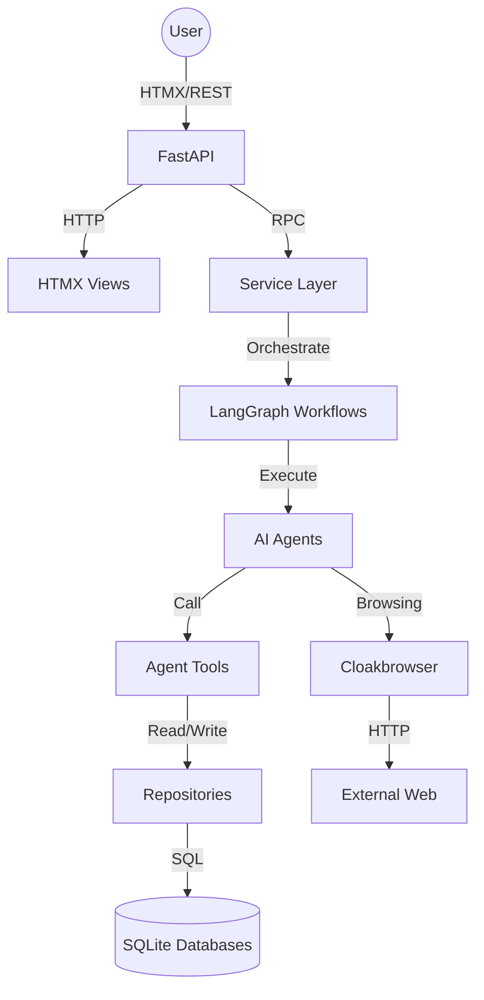

# Omniverse V2 Architecture Codemap

**Last Updated:** 2026-07-11
**Entry Point:** `backend/app/main.py`

## System Overview

Omniverse V2 is a multi-agent fictional power-tiering platform that uses **FastAPI** for HTTP endpoints, **LangGraph** for agent orchestration, and **SQLite** for persistent knowledge storage. The system follows a layered architecture pattern.

## High-Level Architecture



## Layered Architecture

### 1. API/Views Layer (`backend/app/`)
**Purpose**: HTTP request handling and HTMX rendering

| Component | Files | Responsibility |
| :--- | :--- | :--- |
| **Routers** | `api/routers/*.py` | REST API endpoints |
| **Views** | `views/*.py` | HTMX server-rendered pages |
| **Main** | `main.py` | Application entry point |

### 2. Service Layer (`backend/app/services/`)
**Purpose**: Business logic and state coordination

| Service | Key Responsibilities |
| :--- | :--- |
| `universe_service` | World lifecycle, summaries |
| `execution_service` | Run lifecycle management |
| `tiering_service` | Power tiering workflow |
| `theory_service` | Speculative theory handling |
| `knowledge_retriever` | Graph query optimization |
| `research_workspace` | Notebook/file management |
| `settings_service` | Configuration management |

### 3. Repository Layer (`backend/app/repositories/`)
**Purpose**: Pure data access (SQLModel)

| Repository | Database Target | Operations |
| :--- | :--- | :--- |
| `universe` | Main DB | Artifacts, Relations, Evidence |
| `tiering` | Main DB | Tier assignments, Rubrics |
| `theory` | Extrapolation DB | Speculative claims |
| `settings` | Settings DB | Provider configs |
| `execution` | Operational DB | Run logs, state |

### 4. Agent/Workflow Layer (`backend/app/agents/` & `backend/app/workflow/`)
**Purpose**: AI reasoning and state transitions

| Component | Purpose |
| :--- | :--- |
| `agents/nodes.py` | LangGraph node implementations |
| `agents/prompts.py` | Agent system prompts |
| `agents/prompt_templates.py` | Prompt template variables |
| `agents/workflow.py` | State machine definition |
| `agents/workflow_state.py` | Shared state schema |
| `agents/agent_names.py` | Agent name constants |
| `workflow/tiering_workflow.py` | Tiering state machine |
| `workflow/extrapolation_workflow.py` | Extrapolation state machine |

### 5. Core Engine (`backend/app/core/`)
**Purpose**: Low-level utilities and runtime

| Module | Purpose |
| :--- | :--- |
| `agent_engine.py` | Agent turn execution loop |
| `router.py` | LLM provider routing & health |
| `browser.py` | Cloakbrowser manager (Semaphore:5) |
| `tools.py` | Agent tool definitions |
| `runtime_state.py` | ContextVar for `run_id` |
| `context_manager.py` | Token counting, context compression, pruning |
| `context.py` | Universe context management |
| `domain.py` | ResearchTarget, ResearchWorkspace domain objects |
| `web_search.py` | Search engine abstraction |
| `web_fetch.py` | Page fetching |
| `acquisition_cache.py` | Web result deduplication |
| `agent_logger.py` | Structured logging |
| `provider_models.py` | Provider/model schemas |
| `importers/*.py` | OCR, Web page extraction |

### 6. Research Layer (`backend/app/research/`)
**Purpose**: High-level research workflow

| Module | Purpose |
| :--- | :--- |
| `researcher.py` | Research agent implementation |
| `summarizer.py` | Universe summary generation |

## Data Flow: Research Pipeline

The core workflow processes universes from untiered to tiered:

```
1. RESEARCH PHASE
   User Request → Researcher Agent
                ↓
           Web Search & Fetch
                ↓
           Notebook (Working Memory)
                ↓
           Verified Artifacts

2. DB INTEGRATION PHASE
   DB Architect Agent
                ↓
   Predicate Service (Normalization)
                ↓
   Main DB (Artifacts + Relations)

3. SUMMARY PHASE
   Universe Chronicler
                ↓
   Polished Summaries → Display

4. MARK EX plored
   Update `is_explored = True`
```

## Agent Types

| Agent | Role | Tools |
| :--- | :--- | :--- |
| **Researcher** | Fact collection | `webSearch`, `fetchPage`, `saveNotebookEntry` |
| **DB Architect** | DB integration | `queryArtifacts`, `upsertArtifacts` |
| **Universe Chronicler** | Summarization | `queryArtifacts` |
| **Consolidator** | Data consolidation | `queryArtifacts`, `upsertArtifacts` |
| **Tier Architect** | Tiering logic | `queryArtifacts`, `upsertArtifacts` |
| **Logic Auditor** | Consistency check | `queryArtifacts` |
| **Stability Unit** | Rubric enforcement | `queryArtifacts`, `upsertArtifacts` |
| **Ontological Theorist** | Speculation | `queryArtifacts`, `upsertArtifacts` |
| **Theoretical Auditor** | Theory validation | `queryArtifacts` |
| **Rubric Steward** | Rubric management | `queryArtifacts`, `upsertArtifacts` |

## Database Topology

```
┌─────────────────────────────────────────────────────────────┐
│                     Main DB (Canon)                         │
│  ┌──────────┐ ┌─────────┐ ┌─────────────┐ ┌─────────────┐ │
│  │Universe  │ │Artifact │ │ArtifactRel  │ │Evidence     │ │
│  └──────────┘ └─────────┘ └─────────────┘ └─────────────┘ │
│  ┌──────────┐ ┌─────────┐ ┌─────────────┐ ┌─────────────┐ │
│  │TierSys   │ │WorldTier│ │Anomaly      │ │ArtifactVer  │ │
│  └──────────┘ └─────────┘ └─────────────┘ └─────────────┘ │
└─────────────────────────────────────────────────────────────┘
                              ↑
                              │
┌─────────────────────────────────────────────────────────────┐
│                  Staging DB (Notebook)                   │
│  ┌──────────────────┐ ┌──────────────┐ ┌──────────────┐   │
│  │NotebookUniv   │ │NotebookEntry │ │Source        │   │
│  └──────────────────┘ └──────────────┘ └──────────────┘   │
└─────────────────────────────────────────────────────────────┘
                              ↑
                              │
┌─────────────────────────────────────────────────────────────┐
│                  Settings DB (Config)                       │
│  ┌──────────┐ ┌──────────┐ ┌─────────────┐ ┌─────────────┐ │
│  │Setting   │ │Provider  │ │ProviderKey  │ │AgentRoute   │ │
│  └──────────┘ └──────────┘ └─────────────┘ └─────────────┘ │
└─────────────────────────────────────────────────────────────┘
                              ↑
                              │
┌─────────────────────────────────────────────────────────────┐
│              Operational DB (Execution)                     │
│  ┌──────────────┐ ┌────────────────┐                        │
│  │ExecutionState│ │CandidateHealth │                        │
│  └──────────────┘ └────────────────┘                        │
└─────────────────────────────────────────────────────────────┘
```

## External Dependencies

| Dependency | Purpose |
| :--- | :--- |
| **FastAPI** | Web framework |
| **LangGraph** | Agent orchestration |
| **SQLModel** | ORM / Schema definition |
| **Cloakbrowser** | Stealth web browsing |
| **Litellm** | LLM provider abstraction |
| **Pydantic** | Data validation |

## Key Conventions

- **API Prefix**: All routes under `/api`
- **CORS**: Wide open (`*`)
- **CSRF**: Removed for local dev
- **DB Location**: `backend/data/` (overridable via env vars)
- **Log Format**: `[Timestamp] [Agent] [Model] [KeyID] [WorldName] [Type] Content`
- **Context Management**: `ContextManager` handles token counting, context compression, and pruning of raw observations
- **Domain Objects**: `ResearchTarget` and `ResearchWorkspace` provide structured domain modeling
- **Artifact Versioning**: `ArtifactVersion` tracks history of knowledge evolution
- **Parallel Execution**: Batch processing controlled via `MAX_PARALLEL_AGENTS` setting

## Related Areas

- **Backend Module Map** ([BACKEND.md](BACKEND.md)) - Detailed module breakdown
- **Database Map** ([DATABASE.md](DATABASE.md)) - Schema details
- **Frontend Map** ([FRONTEND.md](FRONTEND.md)) - HTMX views
- **File Registry** ([FILES.md](FILES.md)) - Complete file listing

---

*This codemap reflects the current architecture as of 2026-07-11.*
