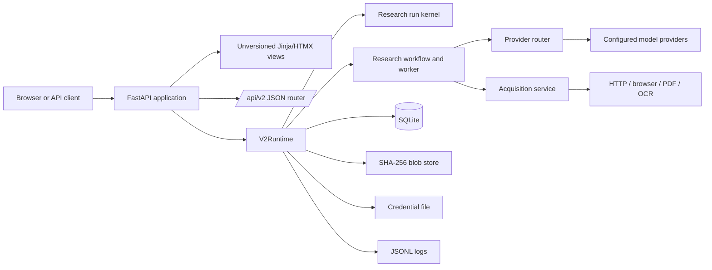

# 1. System map

## Repository layout

```text
.
├── setup.sh / run.sh / test.sh / lint.sh    local developer interface
├── backend/
│   ├── app/main.py                          Uvicorn facade
│   ├── app/v2/                              deployed application package
│   ├── app/templates/                       Jinja pages and HTMX fragments
│   ├── app/static/                          CSS and small browser helpers
│   ├── app/db/default_worlds.json           immutable import seed
│   ├── alembic_v2/                          schema history
│   ├── tests_v2/                            V2 behavioural specification
│   ├── data/                                ignored runtime database/blobs/secrets
│   └── logs/                                ignored structured JSONL logs
├── docs/CODEMAPS_V2/                        concise source-backed maps
└── docs/RECONSTRUCTION_GUIDE/               this rebuild guide
```

The core package has one module per infrastructure concern: `config`, `db`,
`models`, `bootstrap`, `initialize`, `runtime`, `api`, `views`, `workflow`,
`research_runs`, `worker`, `routing`, `gateway`, `providers`, `provider_models`,
`credentials`, `acquisition`, `search`, `wiki`, `preprocessing`, `blobs`,
`projections`, `repositories`, `logging`, `backup`, and `database_resets`.

## V2 module responsibility map

| Module | Owns | Must not own |
|---|---|---|
| `domain.py` | enums, legal run transitions, graph cycle validation | framework, persistence, network access |
| `contracts.py` | strict external/model contracts and projections | business-side effects |
| `models.py` | SQLAlchemy mappings, constraints, revision records | request handling |
| `db.py` | SQLite engine options, migration/schema validation, immutable flush guards | workflow decisions |
| `bootstrap.py` | world-seed validation/import and built-in policies | live service setup |
| `initialize.py` | safe fresh-store initialization and Qwen default seed | web server lifecycle |
| `runtime.py` | dependency composition, startup/shutdown adapter lifecycle | HTML rendering |
| `research_runs.py` | create/get/project, leases, attempts, checkpoints, recovery | model prompts |
| `worker.py` | bounded polling, concurrency, periodic stale-lease reclaim | run-state storage details |
| `workflow.py` | step handlers, evidence/promotion/completion gates | direct provider implementation |
| `acquisition.py` / `search.py` / `wiki.py` | safe fetch/search/wiki inventory and cache reuse | canon promotion |
| `preprocessing.py` / `preprocessor_ssh.py` | deterministic passage selection and optional MiniCPM lifecycle | authoritative evidence creation |
| `providers.py` / `provider_models.py` / `routing.py` / `gateway.py` | provider adapters, selection/fallback, structured output repair | durable workflow orchestration |
| `blobs.py` / `credentials.py` / `backup.py` | hash-addressed bytes, secret storage, SQLite backup/restore | HTTP routes |
| `projections.py` / `repositories.py` | read models and narrowly scoped graph writes | UI transport |
| `logging.py` / `pipeline_debug.py` | redacted structured events and optional diagnostic capture | correctness decisions |
| `api.py` / `views.py` / `main.py` | JSON boundary, Jinja/HTMX boundary, ASGI assembly | domain invariants |
| `database_resets.py` | bounded, dependency-aware administrative resets | blob garbage collection |

The templates mirror the view areas: `pages/` contains shell pages for index,
research, knowledge, provenance, validation, flow, theory, logs, and settings;
`v2/` contains research-world/run/queue fragments, knowledge tab fragments, and
provider/model/route/credential/health/log/general/preprocessor settings fragments.
Keep them logic-light: their inputs are projection dictionaries from `views.py`.

`tests_v2/` is also part of the structure. Its focused files specify acquisition,
backup, boundaries, contracts, concurrency, context budget, evidence workflow,
immutability, logging/activity logging, persistence/schema/seed, provider runtime,
research adapters/gates/runs, settings diagnostics, wiki research, and UI commands
and screens. Cached external reference fixtures live in `tests_v2/fixtures/`.

## Process topology



`create_app` mounts `/static`, installs request-ID/access-log middleware, includes
the view router first and `/api/v2` second, and owns lifespan startup/shutdown.
`V2Runtime.build` is the composition root: it creates the SQLAlchemy engine, blob
store, credential service, provider router, run kernel, query service, acquisition
service, workflow, worker, HTTP client, logging service, and adapter-status map.

## Application lifecycle

1. `run.sh` activates `backend/.venv` (or `backend/venv`), loads
   `backend/.env.local`, anchors relative data paths under `backend/`, enforces
   loopback binding by default, and runs `python -m app.v2.initialize`.
2. Initialization rejects a nonempty unrecognised database, creates directories,
   upgrades Alembic schema, imports the seed, creates the local Qwen development
   route when no explicit configuration replaces it, and validates schema/seed.
3. Uvicorn imports `app.main:app`; FastAPI startup validates the initialized schema,
   restores logging configuration, reconciles stale leases, refreshes adapters and
   optionally remote models, then starts the worker.
4. Each request receives a supplied valid `X-Request-ID` or a UUID. The response
   echoes it and one access event is written.
5. Shutdown stops workers, waits for their tasks, closes adapters and HTTP clients,
   closes logging, and disposes the engine.

## Architectural rules to retain

* Domain state and Pydantic contracts do not depend on FastAPI or the ORM.
* JSON belongs at `/api/v2`; interactive pages use unversioned routes and HTMX.
* One SQLite database is authoritative. Files contain blobs and secrets, never an
  alternative metadata store.
* The worker is persistent-state driven: restart recovery is normal, not exceptional.
* V2 scope ends at research/evidence/canon/provenance/providers/operations.
  `/theory/` is presentation-only; tiering/theory engines do not exist.
