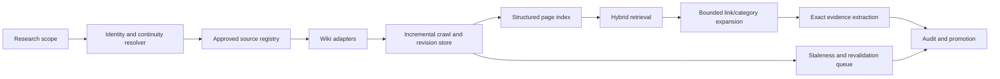

# 5. Wiki research architecture improvements

This document recommends how to evolve Omniverse V2 from safe sitemap-based wiki
selection into a high-recall, revision-aware research platform for many fictional
worlds. It preserves the existing evidence policy: models cannot browse freely,
search leads are not evidence, and promotion requires exact source-backed excerpts.

## Current strengths to preserve

The existing system already has important foundations:

* It discovers and qualifies a same-host wiki before accepting it.
* It validates URLs, redirects, DNS, response size, and content type before fetch.
* Wiki inventory, page queues, source revisions, and workflow steps are durable.
* It gives models page/inventory capabilities rather than arbitrary browser access.
* It requires an extracted quotation to exist in an approved authoritative passage.
* It separates non-evidentiary readability output from authoritative source text.
* It makes canon revisions, audit outcomes, manifests, and integration effects
  immutable and restart-safe.

These controls should remain architectural boundaries as retrieval becomes more
capable. Better discovery must not turn into unconstrained agent browsing.

## Diagnosis

Today, a wiki profile is discovered from one `<world name> wiki` search and qualified
by a same-host `/sitemap.xml`. At most eight sitemap indexes and 500 page URLs are
accepted. The inventory infers its title, aliases, and section terms from the URL
path, then scores a page by lexical overlap between those values and a planned
question. Research is therefore strong at safely using a small, well-labelled wiki,
but weak at finding material where the relevant page is obscure, redirected,
categorised differently, deeply linked, or described only in page body text.

The system also treats an inventory refresh as a general TTL event. It records a
sitemap `lastmod` value but does not yet build a durable page-revision corpus,
retrieve against page contents, or automatically revalidate canon that depends on a
changed page. A single scoped profile is a useful isolation boundary, but a world
often has multiple legitimate sources: official material, a canonical wiki, and
community documentation, each with different authority and continuity coverage.

## Target architecture



The registry and adapters determine what may be crawled. The index determines what
may be retrieved. The workflow then keeps its current extraction, audit, provenance,
and promotion gates. This makes retrieval richer without weakening evidence rules.

## Recommended improvements

### 1. Add a pluggable wiki-adapter boundary

Define a `WikiAdapter` protocol rather than treating every source as a sitemap site.
An adapter should expose only bounded operations: validate a source, enumerate pages,
read a page, fetch revision metadata, resolve redirects, and optionally enumerate
categories/links. Each implementation receives the existing acquisition policy and
must return canonical URLs plus structured, provenance-bearing results.

Initial adapters should cover:

| Adapter | Typical capability |
|---|---|
| MediaWiki API | page IDs, revisions, redirects, categories, links, namespaces, raw wikitext |
| Fandom/MediaWiki variant | API when available, HTML/sitemap fallback otherwise |
| Sitemap/HTML | safe fallback for static or unknown wiki engines |
| Official source adapter | curated documents or site APIs with higher source authority |

Adapter output must include an adapter name/version, source instance ID, page ID,
canonical URL, revision identifier or retrieval timestamp, title, namespace, and
content/extraction metadata. Keep adapters network-safe and make all calls observable
through the existing tool-event and JSONL logging boundaries.

### 2. Add an approved source registry

Replace discovery-only profiles with operator-approved source instances. A registry
entry should bind a world and allowed continuity scope to a source root, adapter,
authority classification, language, allowed namespaces, crawl policy, and health.
One world may have several entries; a source can cover more than one world only when
the mapping is explicit.

Suggested records:

| Record | Essential fields |
|---|---|
| `source_instance` | ID, root URL, adapter, publisher, authority, enabled/health state |
| `source_scope` | source instance, world, continuity, era/branch rules, language |
| `crawl_policy` | rate/concurrency limits, allowed paths/namespaces, freshness, max pages |
| `source_alias` | known root URLs/domains and redirect policy |
| `source_review` | operator, decision, reason, timestamps |

Discovery can propose a registry entry, but it should not become a trusted source
until qualification and operator or configured-policy approval occur. This preserves
the present safe discovery path while making repeat research predictable.

### 3. Store a real, revision-aware wiki corpus

Persist pages independently from fetches and source revisions. Index stable page IDs
where the adapter supplies them, otherwise use canonical URL plus source instance.
Store title, aliases, redirects, namespace, categories, infobox/structured fields,
section hierarchy, outbound links, text hash, revision ID, revision timestamp, and
the raw/cleaned content blob references.

Suggested additions:

```text
wiki_page                 source_instance + stable page ID + current metadata
wiki_page_revision        immutable content/revision snapshot
wiki_page_section         revision + heading path + offsets + section text reference
wiki_page_alias           title, redirect, display alias, disambiguation alias
wiki_page_category        page-revision/category relationship
wiki_page_link            page-revision/source/target link relationship
wiki_crawl_job/item       durable scheduling, retry, rate-limit, and cursor state
wiki_index_version        derived-index provenance and rebuild state
```

Do not replace the existing generic `source` and `source_revision` records. Relate
wiki page revisions to them, so every citation still resolves to the repository-wide
source-revision/evidence model.

### 4. Use hybrid retrieval instead of URL-title matching alone

Build a local lexical index over title, aliases, section headings, body text,
categories, and infobox fields. SQLite FTS5/BM25 is a suitable first step because it
remains local, inspectable, and inexpensive. Add embeddings only as a second ranking
signal; retain lexical matching for explainability and exact named entities.

Retriever inputs should include resolved subjects, continuity, era, branch,
conditions, question terms, and optionally relation intent. Filter before ranking:

1. source is enabled and allowed for the scope;
2. page belongs to the correct continuity/language/namespace;
3. page revision is current enough for the research policy;
4. sections score by lexical and semantic relevance;
5. final selection is diversified across page type and source instance.

Return an explanation for every result: matching aliases, heading/category/field,
lexical score, semantic score, source authority, and freshness. The model should see
only selected page/section IDs and bounded excerpts, just as it does today.

### 5. Resolve identity and continuity before retrieval

Introduce a deterministic resolver for world names, subjects, aliases, eras,
timelines, branches, and disambiguation pages. It should return a confidence level
and never silently collapse uncertain identities. If two continuities are plausible,
the workflow should ask for input or create an explicit gap rather than mix evidence.

Maintain source-specific aliases separately from canon nodes. A source can call the
same character by a different spelling while still mapping to one scoped subject.
Record how a resolution was made so it is auditable and can be corrected without
rewriting historical evidence.

### 6. Make crawling incremental and staleness-aware

Use adapter revision IDs, sitemap `lastmod`, recent-changes feeds, ETags, and
conditional HTTP requests to schedule only changed pages. Crawl work should use a
durable queue with per-domain rate limits, backoff, ownership leases, and explicit
failure classes, similar to the existing research-run kernel.

When a page revision changes, compare extracted sections and locate dependent evidence
fragments, proposals, summaries, and canon revisions. Mark them `STALE` or enqueue a
revalidation run; do not delete them or mutate immutable history. A stale fact can
remain visible with its prior evidence and a freshness warning until review succeeds.

### 7. Support bounded graph expansion

For a retrieved page, allow a retrieval policy to follow a limited number of redirects,
categories, links, and template-derived references. Examples include a character page
linking to their equipment, a timeline event, and a location. Expansion must be
bounded by depth, page count, source authority, and question budget; it should not
be initiated by arbitrary model URLs.

Use page types and diversity rules to avoid returning ten near-identical pages. A
good default is one subject page, one event/location/mechanism page, and one
independent supporting source where available.

### 8. Model source authority and claim-level reliability

Make source ranking policy data-driven. Store authority (official primary, licensed
reference, curated community, unverified community), publisher/lineage, editorial
state, coverage scope, and known quality concerns. Apply authority as a retrieval and
audit signal, not as a substitute for exact evidence.

Different claim types should use different rules. A release date may prefer an
official publication; a plot recap may be acceptable from a community wiki; a
continuity-sensitive assertion should require a source explicitly tagged to that
continuity. Conflicts should retain both evidence chains and expose a reasoned
precedence policy rather than overwriting one answer.

### 9. Add operational quality and curation interfaces

Provide an administrative source-onboarding flow for approving sources, choosing an
adapter, mapping continuity and namespaces, seeding high-value pages, and testing
adapter health. Add dashboards for crawl freshness, coverage, retrieval result mix,
unresolved aliases, stale evidence, conflict rates, and failed page reads.

For each research result, expose a retrieval trace: source instances considered,
filters applied, selected/rejected pages, queue state, passages used, and promotion
outcome. This makes poor recall diagnosable without reading server logs.

## Delivery roadmap

| Phase | Deliverable | Outcome |
|---|---|---|
| 1 | Registry, manual source onboarding, MediaWiki + sitemap adapters | reliable known-wiki reuse and source governance |
| 2 | Page/revision/section corpus plus FTS5 index | body/section retrieval and stable citations |
| 3 | Identity resolver, redirects/categories/links, hybrid ranking | stronger recall without continuity mixing |
| 4 | Incremental crawler and dependency-driven stale revalidation | fresh knowledge with immutable historical provenance |
| 5 | Source-quality policy, dashboards, curation/retrieval traces | measurable quality and manageable multi-world operations |

Start with Phase 1 and Phase 2. They solve the current high-impact limitations—the
one-off discovery path, sitemap ceiling, URL-derived metadata, and title-only
selection—while fitting the existing durable SQLite/workflow architecture.

## Acceptance criteria

An implementation should demonstrate all of the following:

* A pre-approved MediaWiki source and a sitemap-only source can research the same
  world using their appropriate adapter without arbitrary web access.
* A page found only by redirect, category, infobox, or body-section text is retrievable
  with an explanation of why it ranked.
* Ambiguous subject or continuity resolution produces a durable gap or explicit user
  decision; it never mixes evidence silently.
* Every selected excerpt still points to a source revision, page revision, stable
  locator, and exact authoritative text.
* A changed source page marks dependent output stale and schedules bounded
  revalidation without mutating prior evidence or canon history.
* Crawl/retrieval limits, per-host rate limits, redirect/DNS policy, credential
  redaction, model capability restrictions, and restart recovery retain the current
  security and reliability guarantees.
