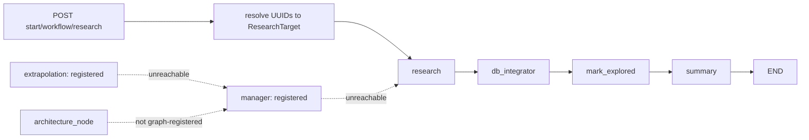
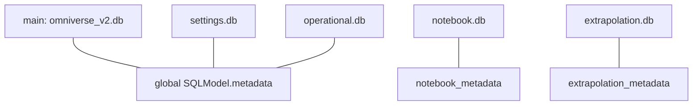

# Current Omniverse V2 System Reconstruction

**Status:** SOURCE-BACKED BASELINE
**Inspection date:** 2026-07-23
**Tests executed for this document:** NO

## Overview

The running system is a FastAPI application with unversioned Jinja/HTMX views, a `/api/v1` API, LangGraph orchestration, LiteLLM routing, and five SQLite files. Runtime source differs from older architecture documentation and from several route comments.

## Runtime truth and stale material

Runtime truth starts at [`backend/app/main.py`](../../backend/app/main.py). It imports routers under `app/api/v1` and `app/views`. The old `backend/app/api/routers/`, `backend/app/views/research_results.py`, and `backend/templates/pages/` are not mounted by `main.py`.

Use the following precedence when reconstructing behavior:

1. mounted routes and imported code;
2. session modules and model metadata;
3. called services and repositories;
4. tests as evidence of intent, not runtime truth;
5. existing prose only when source confirms it.

## Entry point and lifespan

Importing `app.main` imports [`core/browser.py`](../../backend/app/core/browser.py). That module loads `backend/data/adservers.txt` or performs a five-second network fetch and writes the cache during import. Application import can therefore perform network and filesystem I/O before lifespan begins.

The lifespan in [`main.py:38-78`](../../backend/app/main.py) performs:

1. `init_db()`, which creates tables across five engines;
2. a main-database `SELECT 1`, logging but not failing startup on error;
3. stale execution-log reconciliation;
4. settings validation, also non-fatal;
5. `browser_manager.start()`, which does not launch browsers because launch is lazy;
6. browser-pool shutdown after yield.

CORS permits `localhost:3000` and `127.0.0.1:3000`. Static files mount at `/static`. `/api/health` always returns `{"status":"ok"}` and does not report dependency health.

## Active route surface

### HTML views

| Prefix | Contract | Source |
|---|---|---|
| `/` | Home shell | [`views/index.py`](../../backend/app/views/index.py) |
| `/research` | Research page, queue, focused search, run results, notebook and sources fragments | [`views/research.py`](../../backend/app/views/research.py) |
| `/settings` | General settings, provider/key/route CRUD, model sync, health, resets, snapshots | [`views/settings.py`](../../backend/app/views/settings.py) |
| `/worlds` | Legacy world list, import/create/delete, hierarchy, active-world cookie, details | [`views/worlds.py`](../../backend/app/views/worlds.py) |
| `/knowledge` | World selection, overview, artifact, notebook, and theory tabs | [`views/knowledge.py`](../../backend/app/views/knowledge.py) |
| `/validation` | Open notebook entries, nominal approve/reject, duplicate candidates | [`views/validation.py`](../../backend/app/views/validation.py) |
| `/provenance` | First-evidence display for artifact or empty notebook provenance | [`views/provenance.py`](../../backend/app/views/provenance.py) |
| `/flow` | Artifact lookup with a simplified, mostly empty trace | [`views/flow.py`](../../backend/app/views/flow.py) |
| `/theory` | Theory list; reevaluate action returns static text | [`views/theory.py`](../../backend/app/views/theory.py) |
| `/logs` | Filterable file-log page and tail pagination | [`views/logs.py`](../../backend/app/views/logs.py) |

### JSON and mixed API

[`api/v1/__init__.py`](../../backend/app/api/v1/__init__.py) mounts these families under `/api/v1`:

| Family | Current responsibility |
|---|---|
| `/db/worlds` | World CRUD, explored flags, database reset, log clearing |
| `/db/artifacts` | JSON listing plus HTML list/search/detail and loosely typed save |
| `/db/notebook` | Notebook entry create/update/delete through agent tools |
| `/db/claims` | Claims, combined results, tiers, and theories |
| `/execution/runs` | Start, tier, extrapolate, focused search, abort/resume, logs, run fragments |
| `/settings` | General settings, providers, plaintext keys, routes |
| `/tools/worlds` | A second, overlapping world/research/import/reset/snapshot API |

The API mixes JSON resources, commands, HTML fragments, duplicate world endpoints, and destructive maintenance operations.

## Active workflows

### Connected LangGraph research path



[`agents/workflow.py`](../../backend/app/agents/workflow.py) sets `research` as the entry point and connects only `research -> db_integrator -> mark_explored -> summary -> END`. `manager` and `extrapolation` are registered but unreachable. `architecture_node` exists in [`agents/nodes.py`](../../backend/app/agents/nodes.py) but is not registered.

The research node batches worlds, calls `research_single_world`, collects successful dictionaries, and tolerates partial failure. The DB integrator invokes a second agent for each `VERIFIED` result. It logs completion even when individual integrations fail. `mark_explored` marks every world represented in `research_results`, not every successfully integrated world. The summary node receives UUID values in `verified_worlds`, then calls `get_by_names`; this conflicts with its name-based lookup. These UUID/name mismatches can suppress summaries.

### Focused search

Focused search enters the same research graph with `is_focused_search=True`. `summary_node` returns `active_task=ARCHITECTURE`, but its fixed outgoing edge goes to `END`. The architecture transition is ignored.

The HTMX form passes comma-separated `worlds` directly to a function expecting universe UUIDs. The API payload is named `universe_uuids`, but other UI routes pass names. See [`views/research.py:50-79`](../../backend/app/views/research.py) and [`api/v1/execution/runs.py:143-198`](../../backend/app/api/v1/execution/runs.py).

### Tiering

`POST /api/v1/execution/runs/tiering` calls `architecture_node(state)` once and ignores its returned follow-up state. The node can request `RE_ARCHITECTURE` or `EXTRAPOLATION`, but no caller continues the loop. The internal attempt cap raises after five architecture attempts; another branch treats three unresolved anomaly rounds as completion and writes tier `-1`.

### Extrapolation

`POST .../extrapolate` builds a state with `active_task=EXTRAPOLATION` and invokes `app_graph`. LangGraph still starts at `research`, where `target_worlds` contains names rather than `ResearchTarget` objects. The endpoint therefore starts the wrong graph path. The standalone extrapolation node is reachable only by direct calls not used here.

### Abort, resume, and restart

Active, aborted, and failed state lives in [`core/runtime_state.py`](../../backend/app/core/runtime_state.py). It is process-local. Restart loses abort and resume metadata. Startup reconciliation only appends `FAILED` to runs whose latest execution-log status matches a small active-status set. There is no durable work queue or step checkpoint.

## Agent engine, tools, browser, and acquisition

[`core/agent_engine.py`](../../backend/app/core/agent_engine.py) runs a tool loop with capability-based filtering. Capabilities cover main DB read/write, workspace read/write, acquisition, and submit. Tool schemas and handlers share the large [`core/tools.py`](../../backend/app/core/tools.py) module.

Active tool areas include:

- web search, page fetch, and OCR;
- notebook entries, sources, and workspace lookup;
- polymorphic artifact query/upsert/delete;
- claim and knowledge-graph lookup;
- universe and entity links;
- batched `executePlan` handling in the engine.

The browser manager in [`core/browser.py`](../../backend/app/core/browser.py) uses a lazy Cloakbrowser process pool. Defaults are two processes and five contexts per process. It persists shared cookies and blocks blacklist domains. Search/page results pass through a process-local LRU plus notebook-database acquisition cache keyed by URL and content hash. Usage and provenance tables exist, but handlers do not create complete provenance edges for every promoted artifact.

## Provider routing

[`core/router.py`](../../backend/app/core/router.py) reads task-specific `AgentRouteFallback` rows, then `DEFAULT` routes. It expands each route into provider, model, and key candidates, interleaving keys by model. LiteLLM receives the model prefix, API key, and provider `base_url`.

Persistent `CandidateHealth` rows track failures and a four-hour disable window after five failures. A separate `_cooldowns` dictionary is checked but never populated, so the in-memory rate-limit cooldown is nonfunctional. Per-call key failures disappear after the call.

Capability synchronization is provider-aware through `(provider_id, model_name)`. Context lookup in [`agent_engine.py:180-195`](../../backend/app/core/agent_engine.py) queries by model name only, ignoring provider. Model synchronization also has multiple implementations: async `ModelRouter.sync_provider_models`, sync `ProviderService.sync_provider_models`, and [`core/provider_models.py`](../../backend/app/core/provider_models.py). They use different databases and endpoint rules.

Provider keys are plaintext columns. `ProviderService.get_providers()` returns each full `api_key`, and both HTML and `/api/v1/settings/general` data paths can expose them. See [`services/provider_service.py:14-37`](../../backend/app/services/provider_service.py).

## Context handling

The global `ContextManager` reads `MAX_TOKENS`, but actual compression thresholds use `model_window * COMPRESSION_THRESHOLD`. `ContextManager.max_tokens` does not limit those checks. The first model call occurs before `model` is known, so there is no pre-first-call fit check.

Observation pruning protects 40k tokens and requires at least 20k tokens freed. That cannot help many 40k-window calls. Raw tool messages are deleted after a write tool without validating that the durable write captured them. Removing tool-result messages can leave malformed assistant tool-call sequences. Compression preserves the first goal and five recent messages, asks a model for a summary, and stores that summary only in a process-local `ContextVar`. See [`core/context_manager.py`](../../backend/app/core/context_manager.py) and [`core/runtime_state.py:162-177`](../../backend/app/core/runtime_state.py).

## Persistence: five SQLite files



Main, settings, and operational engines all call `SQLModel.metadata.create_all`. They therefore duplicate every global table, not only the tables their names imply. Repositories choose a particular engine, creating multiple copies with divergent contents. Notebook and extrapolation use separate metadata.

| Schema group | Actual models | Intended/observed engine use |
|---|---|---|
| Registry | `Universe`, `UniverseRelation` | Main |
| Canon/knowledge | `Artifact`, `ArtifactRelation`, `Evidence`, `EvidenceChunk`, `ArtifactVersion` | Main |
| Tiering | `TierSystem`, `WorldTier`, `Anomaly` | Main |
| Execution | `ExecutionState` | Main, despite operational duplication |
| Provider/settings | `Setting`, `ProviderConfig`, `ProviderKey`, `AgentRouteFallback`, `ModelConfig`, `ModelCapability` | Settings |
| Candidate health | `CandidateHealth` | Operational |
| Notebook/workspace | `NotebookUniverse`, `NotebookClaim`, `NotebookEntry`, `ResearchSource`, `WorldDomainCache`, `VisitedUrl`, `Snapshot` | Notebook |
| Acquisition | `AcquisitionArtifact`, `WorldAcquisitionUsage`, `ProvenanceEdge` | Notebook |
| Theory | `Theory` | Extrapolation |

The checked-in main database snapshot was observed as registry-heavy, with many world records and little or no canon artifact content. Treat this as a snapshot observation, not a schema invariant or production guarantee.

## Request-to-persistence flow

```mermaid
sequenceDiagram
    actor U as User/HTMX
    participant R as FastAPI route
    participant G as LangGraph
    participant A as Research agent
    participant N as notebook.db
    participant I as DB Architect agent
    participant M as main DB
    participant L as Execution/file logs
    U->>R: start with world UUIDs
    R-->>U: run_id
    R->>G: background ainvoke
    G->>A: research world
    A->>N: cache, notebook, sources
    A->>L: prompts/tool events/transitions
    G->>I: integrate result
    I->>M: artifacts/evidence JSON
    G->>M: mark explored; write summary
```

No transaction spans notebook acquisition, canon integration, explored status, and summary. A partial result can persist and the world can become explored despite integration failure.

## Frontend page contracts and rebuild disposition

| Surface | Current contract | Rebuild disposition |
|---|---|---|
| Shell/home | Navigation and dashboard frame | RETAIN |
| Research | Choose/start, queue, focused panel, results/workspace fragments | RETAIN/ADAPT |
| World details/fragments | Registry CRUD, details, hierarchy | RETAIN/ADAPT |
| Knowledge | World selector and tabbed artifact/notebook/theory inspection | RETAIN/ADAPT |
| Logs | Filters and tail-paginated fragments | RETAIN/ADAPT |
| Settings | General/provider/route/health forms | RETAIN/ADAPT; make secrets write-only |
| Validation | Resolve/delete notebook items; merge stub | REPLACE BEHAVIOR |
| Provenance | First evidence only; notebook path empty | REPLACE BEHAVIOR |
| Flow | Simplified artifact display, not a trace | REPLACE BEHAVIOR |
| Theory | List presentation; static reevaluate action | RETAIN PRESENTATION, REPLACE ACTION |
| Deprecated Worlds and choose-world | Parallel navigation paths | REMOVE AFTER MIGRATION |

## Tests and tooling

Repository inventory is roughly 1,015 test function definitions across 98 Python test files. Coverage spans repositories, services, routes, workflows, context, providers, tools, UI fragments, browser E2E, and live prompts. The suite is broad but contains stale assumptions, skipped paths, shallow status assertions, duplicated fixtures, and state leakage risks.

[`test.sh`](../../test.sh) uses `-m "not slow"` by default, which does not exclude tests marked only `network`. `--ui` runs the UI directory once, then runs all `backend/tests` again. `--slow` selects only slow tests rather than adding them. This differs from project guidance and from `backend/pyproject.toml`, whose addopts exclude both `network` and `slow`. Python targets also drift: current packaging and Ruff/Mypy specify 3.9, while the rebuild targets 3.12+.

No tests were run during this documentation task.

## High-impact defects

| Severity | Defect | Consequence |
|---|---|---|
| CRITICAL | Graph entry and edges bypass manager, architecture, and extrapolation | Advertised pipeline does not execute |
| CRITICAL | Tiering ignores returned next state; extrapolation invokes wrong entry path | Commands report started without completing intended workflow |
| CRITICAL | Five engines plus shared global metadata duplicate authoritative tables | Reads and writes can target divergent copies |
| HIGH | Partial research results mark worlds explored despite integration failures | Registry status overstates persisted knowledge |
| HIGH | UUID/name mismatches in summaries and UI background calls | Valid work resolves to no worlds |
| HIGH | Run, abort, resume, and summary state is process-local | Restart loses control and recovery context |
| HIGH | Context has no first-call fit check and can create malformed history | Provider overflow and invalid tool protocol |
| HIGH | Provider keys are stored and returned in plaintext | UI/API/log exposure risk |
| HIGH | Canon artifacts are type-tagged JSON with JSON evidence IDs | Weak validation, joins, provenance, and evolution |
| HIGH | Verification status is largely nominal; provenance edges are incomplete | “Verified” cannot be reconstructed reliably |
| HIGH | `WorldTier` is unique by universe and upsert deletes prior assignment | Classification history cannot be preserved |
| HIGH | Research results query `Artifact.run_id`, a field absent from the schema | `/research/results/{run_id}` fails when it evaluates the query |
| HIGH | Search tooling references `urlparse`, `WorldDomainCache`, `datetime`, and `timezone` without imports | Successful search processing can fail before returning results |
| MEDIUM | Theory upsert deletes prior text and stores only text plus feedback | No premises, evidence revision, falsifiers, or history |
| MEDIUM | Validation, provenance, flow, and theory actions are stubs or partial | UI implies controls and traces that do not exist |
| MEDIUM | Validation reads `Artifact` through `settings_engine`; snapshot creation passes nonexistent `metadata` | Promotions appear empty and snapshot creation can fail validation |
| MEDIUM | Import-time blacklist fetch/write | Import is nondeterministic and unsafe in restricted environments |
| MEDIUM | Test wrapper and marker semantics drift | Local and CI test selections can differ |

## Next steps

Use [02-requirements.md](02-requirements.md) to validate the target outcomes before approving architecture or implementation.
