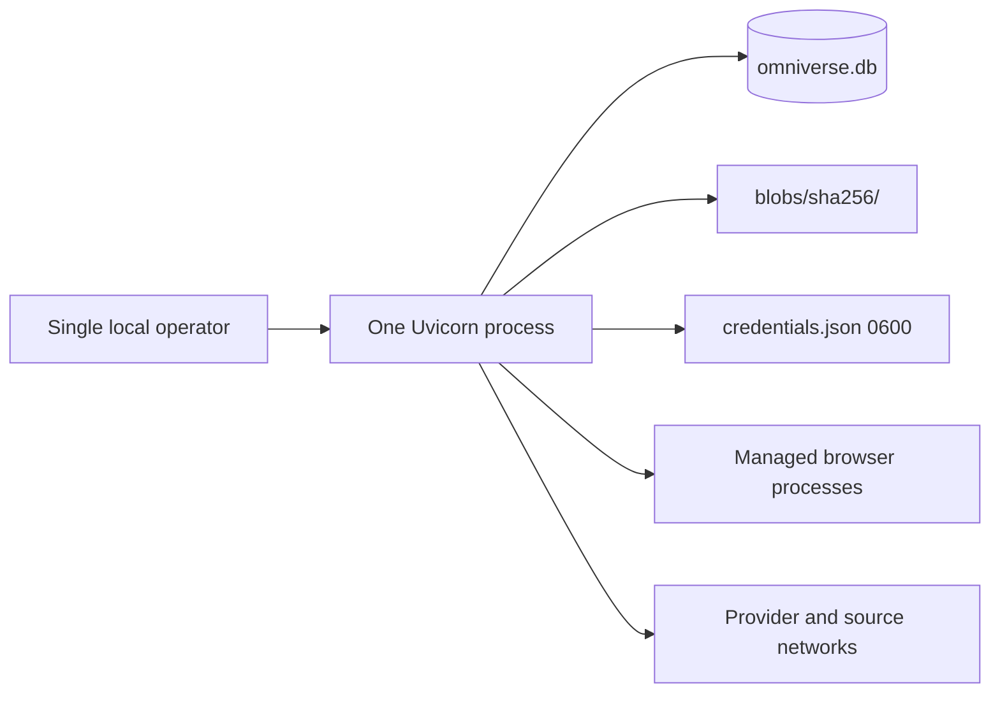
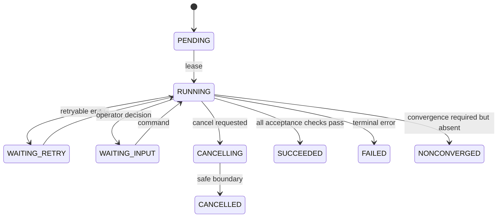
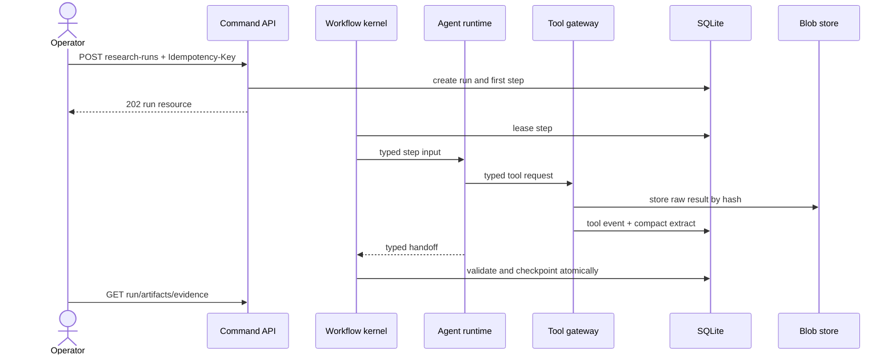

# Target Architecture for Omniverse V2

**Status:** PROPOSED RECOMMENDATION

## Overview

Build a modular monolith on Python 3.12+, FastAPI, SQLAlchemy 2.x, Alembic, Pydantic, Jinja, and HTMX. One SQLite database owns durable truth. A content-addressed filesystem stores disposable or reconstructable source bodies and tool results.

## Component architecture

```mermaid
flowchart TB
    B[Browser] --> V[Unversioned HTML views]
    B --> A[/api/v2 resources]
    V --> P[Projection/query layer]
    A --> C[Application commands and queries]
    C --> W[Durable workflow kernel]
    W --> R[Agent runtime]
    R --> PA[Provider adapters]
    R --> T[Tool gateway]
    T --> Q[Acquisition service]
    C --> D[(Authoritative SQLite + WAL)]
    W --> D
    P --> D
    R --> D
    Q --> D
    Q --> BS[(Content-addressed blob/cache store)]
    PA --> LLM[Gemini / OpenAI / local compatible]
    Q --> WEB[Web sources]
```

The application layer owns transaction boundaries and state transitions. Domain modules do not import FastAPI, Jinja, LiteLLM, or SQLAlchemy models.

## Deployment



Run one application process. Browser subprocesses may run concurrently. Do not run multiple Uvicorn workers against the workflow scheduler. WAL improves read concurrency; it does not justify competing workflow owners.

## Recommended module layout

```text
backend/app/
  main.py
  api/v2/                 # JSON routers and Pydantic HTTP contracts
  views/                  # unversioned pages and fragments
  domain/
    worlds.py
    evidence.py
    artifacts.py
    profiles.py
    tiering.py
    theories.py
    runs.py
  application/
    commands/             # transaction-scoped use cases
    queries/              # projection queries
    workflows/            # durable state machines
  agents/
    roles/                # bounded role definitions
    contracts/            # typed handoffs
    context/              # manifests, budgets, compaction
    routing/              # policies and candidate selection
  infrastructure/
    db/                   # SQLAlchemy mappings, unit of work
    migrations/           # Alembic revisions
    providers/            # Gemini, OpenAI, OpenAI-compatible
    acquisition/          # search, browser, extraction, cache
    credentials/          # credential-reference resolver
    observability/        # events, metrics, redaction
  projections/            # page and fragment view models
  templates/
```

## Data architecture

### Database policy

- Use one `omniverse.db` with `journal_mode=WAL`, `foreign_keys=ON`, a busy timeout, and an explicit transaction mode.
- Use SQLAlchemy 2.x typed mappings and Alembic migrations. Do not call `create_all` during normal startup.
- Keep write transactions short. Acquire work, perform network/model work outside a transaction, then commit validated output with optimistic version checks.
- Add a monotonically increasing revision or `updated_at` guard to mutable aggregates.
- Use SQLite online backup for snapshots. Never copy live database files directly.

### Table groups

| Group | Core tables | Rule |
|---|---|---|
| Registry | `world`, `continuity`, `timeline_branch`, `subject`, `subject_relation`, `power_profile`, `profile_condition` | Stable subjects are scoped by continuity, branch, era, and conditions. |
| Sources | `source`, `source_revision`, `evidence_fragment`, `citation` | Revisions are immutable and content-hash addressed. |
| Canon graph | `canon_node`, typed subtype tables, `canon_node_revision`, `relationship_assertion`, `relationship_revision`, `node_evidence`, `relationship_evidence` | Nodes and edges are typed, revisioned, scoped, temporal, and evidence-linked. |
| Research | `research_run`, `research_target`, `research_lead`, `promotion_decision` | Staging remains separate logically, inside the same DB. |
| Workflow | `run`, `run_step`, `step_attempt`, `checkpoint`, `outbox_event`, `tool_event` | The kernel owns status and recovery. |
| Context | `context_manifest`, `structured_summary`, `context_item`, `model_call` | Calls rebuild from manifests. |
| Providers | `provider`, `model`, `model_capability`, `credential_ref`, `route`, `route_candidate`, `candidate_health` | No secret material in rows or read DTOs. |
| Tiering, added after research gate | `procedure_version`, `rubric_version`, `rubric_tier`, `classification`, `classification_dimension`, `anomaly`, `rubric_change_impact` | History is append-only. |
| Theory, added after research gate | `theory`, `theory_revision`, `theory_premise`, `theory_assumption`, `theory_outcome`, `theory_falsifier`, `theory_evidence` | Theory never joins canon as an artifact subtype. |
| Operations | `event`, `request_log`, `seed_run` | Redacted and retention-controlled. |

Use a disposable filesystem layout such as `blobs/sha256/ab/<hash>`. The DB stores hash, media type, byte count, extractor version, and reference state. Deleting cache files must not invalidate canon: referenced source revisions need retained content or a durable excerpt sufficient for audit.

### Canon graph semantics

The verified store is a temporal, evidence-linked knowledge graph. It does not flatten researched facts into isolated JSON artifacts.

Core node kinds are `GenericConcept`, `Mechanism`, `Model`, `Instance`, `Specification`, `Capability`, `Constraint`, `DeploymentFact`, and `TimelineEvent`. `Mechanism.modality` supports `TECHNOLOGICAL`, `MAGICAL`, `PSYCHIC`, `BIOLOGICAL`, `DIMENSIONAL`, `REALITY_ALTERING`, `TEMPORAL`, `CAUSAL`, `CONCEPTUAL`, `ONTOLOGICAL`, and `HYBRID`. Technology is one modality, not the parent of all fictional effects.

Named concrete objects use one stable subject identity with an `Instance` canon node linked to a `Model`; they do not receive competing identities. Initial specifications use validated quantity, range, enum, text, and reference values, plus domain-specific schemas where invariants require them.

Relationships such as `IS_A`, `IMPLEMENTS`, `USES`, `INSTANCE_OF`, `HAS_SPECIFICATION`, `COMPOSED_OF`, `INSTALLED_IN`, `HAS_CAPABILITY`, `LIMITED_BY`, `COUNTERED_BY`, `PARTICIPATES_IN`, `AFFECTED_BY`, `INTRODUCES`, `DISABLES`, `SUPERSEDES`, `PRECEDES`, `CAUSES`, and `DERIVED_FROM` are assertions with their own revisions and evidence. They are not bare join rows.

Generic knowledge is never copied into every model or instance. Effective-knowledge projections traverse explicit active `IS_A`, `IMPLEMENTS`, `INSTANCE_OF`, and specification links, apply continuity/time/condition predicates, then overlay narrower exceptions. Applicability is opt-in through explicit relationships; matching names or taxonomy alone cannot imply inheritance. Each projected fact retains its source node and evidence references.

Timeline records distinguish fictional valid time, source publication time, retrieval time, and database recording time. Exact ranges, approximate dates, relative ordering, disputed order, timeless effects, loops, and branching timelines are representable. Retcons append superseding revisions or continuity branches rather than rewriting prior history.

## Canon and theory enforcement

Canon and theory use separate aggregate roots, tables, repositories, API resources, and projections. `node_evidence` and `relationship_evidence` accept only source/evidence revisions. Theory may cite canon nodes, relationships, and evidence, but canon queries never union theory rows. Promotion from theory requires a new research and canon decision; it never changes the existing theory record.

## Durable workflow state machine



Each workflow definition declares legal transitions, step input/output schemas, retry policy, compensation, and completion predicate. A scheduler transaction leases one runnable step. A checkpoint commits step output, next state, domain writes, and outbox events together. LangGraph may execute an isolated reasoning step, but its state is an ephemeral implementation detail inside that step.

## Data flow



## Concurrency and durability

- Assign one scheduler task as workflow owner.
- Use a bounded semaphore per provider and tool class.
- Store leases with expiry and owner ID. Reclaim expired leases during startup reconciliation.
- Require idempotency keys for command requests and deterministic keys for step effects.
- Commit tool metadata before exposing its result to the next step.
- Never hold a database transaction across HTTP, browser, OCR, or model calls.
- Use an outbox table for post-commit UI/event notifications.
- Mark a target complete only when required artifact and summary writes commit.

## Projection layer and HTMX contracts

Projection queries return page-specific Pydantic view models. Templates do not traverse ORM relationships or open sessions.

| HTML route | Fragment contract | Target behavior |
|---|---|---|
| `/research` | `/research/fragments/run-list`, `/research/fragments/run/{id}` | Replace run list/detail; poll durable run state. |
| `/worlds/{id}` | `/worlds/{id}/fragments/{overview|profiles|artifacts}` | Replace named panel only. |
| `/knowledge` | `/knowledge/fragments/world-list`, `/knowledge/fragments/world/{id}/{tab}` | Stable tab view models. |
| `/logs` | `/logs/fragments/events?cursor=` | Append or prepend by cursor; preserve filters. |
| `/settings` | `/settings/fragments/{providers|routes|health}` | Never render stored credential value. |
| `/validation` | `/validation/fragments/queue` | Real promotion decisions and conflicts. |
| `/provenance/{artifactRevisionId}` | fragment by citation/evidence ID | Render full revision chain. |
| `/flow/{runId}` | step/event timeline fragment | Render durable workflow, not inferred artifact data. |
| `/theory` | `/theory/fragments/list`, `/theory/fragments/{id}` | Preserve list presentation; execute real revision commands. |

Fragments return `200` for content, `204` for successful removal, `404` for missing resources, `409` for stale versions/state conflicts, and `422` for validation. Use `HX-Trigger` for typed toast and refresh events.

## API resource families

All JSON endpoints live under `/api/v2`:

| Family | Representative operations |
|---|---|
| `/worlds`, `/worlds/{id}/profiles` | Registry and scoped profile CRUD |
| `/research-runs` | Create research command; inspect targets and output |
| `/runs` | Inspect, cancel, retry, resume, and list step events |
| `/artifacts` | Query canon; inspect immutable revisions and relations |
| `/evidence` | Query sources, revisions, fragments, and citations |
| `/mechanisms`, `/models`, `/instances` | Traverse reusable concepts, concrete designs, instances, and effective specifications |
| `/relationships`, `/timeline-events` | Query evidence-linked graph assertions and continuity-aware chronology |
| `/rubrics` | Create draft, audit, activate, and inspect versions |
| `/classifications` | Classify profiles and inspect vectors/history |
| `/anomalies` | Review anomaly records and resolution impact |
| `/theories` | Generate, revise, audit, and inspect structured theories |
| `/providers` | Provider/model metadata and write-only credential commands |
| `/routes` | Ordered task-routing policies and health-aware candidates |

Collections return `{"items": [...], "nextCursor": "..."}` with bounded `pageSize`. Errors return:

```json
{
  "error": {
    "code": "RUN_STATE_CONFLICT",
    "message": "Run is already terminal.",
    "details": [{"field": "status", "code": "EXPECTED_ACTIVE"}],
    "requestId": "req_01..."
  }
}
```

Command POSTs accept `Idempotency-Key`. A repeated key with the same payload returns the existing resource; a different payload returns `409 IDEMPOTENCY_CONFLICT`.

## Credentials

API and UI inputs are write-only. Reads return credential ID, label, priority, created time, last-used time, and a fixed mask such as `••••••••`; they never return a suffix copied from the secret.

The practical local default is `backend/data/secrets/credentials.json`, created with directory mode `0700` and file mode `0600`. Store random opaque credential IDs as keys and provider secrets as values. Write through a temporary file, `fsync`, atomic rename, and permission verification. Database `credential_ref` rows point to those IDs. Environment-variable references remain supported for unattended use. Logs and exceptions redact resolved values.

## Observability and security

- Emit structured events for request, transition, model call, tool call, retry, budget, and seed operations.
- Record tokens, estimated cost, latency, candidate, and error class without full prompt bodies by default.
- Give each request, run, step, attempt, tool event, and model call an ID.
- Expose local health for schema revision, scheduler lease, browser availability, blob permissions, and provider configuration.
- Validate outbound URLs, block `file:` and private-network destinations by default, limit redirects/body size/time, and normalize domains.
- Escape template data and validate all HTMX form inputs with Pydantic.
- Bind to loopback by default. If remote binding is later enabled, add authentication as a separate decision.

## Next steps

Review the execution details in [04-agent-runtime.md](04-agent-runtime.md), the primary research design in [05-research-system.md](05-research-system.md), and the deferred classification design in [06-tiering-and-theory.md](06-tiering-and-theory.md).
