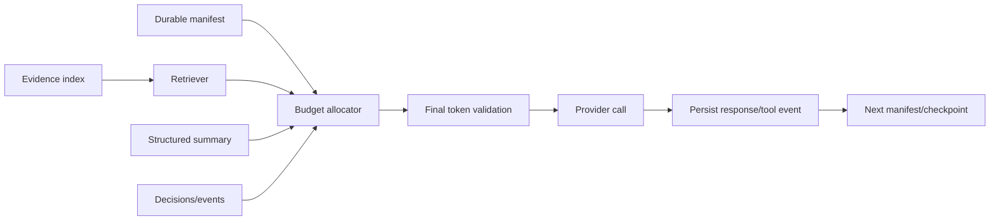

# Agent Runtime Design

**Status:** PROPOSED

## Overview

The agent runtime executes bounded reasoning steps inside the durable workflow kernel. Every role receives a typed handoff, uses an allowlisted tool set, and returns validated structured output. The runtime persists evidence, decisions, summaries, and tool events without preserving chain-of-thought.

## Roles and handoffs

| Role | Input contract | Output contract | Allowed effects |
|---|---|---|---|
| Research Planner | `ResearchBrief` | `ResearchPlan` | Create leads and source queries. |
| Source Scout | `SourceSearchTask` | `SourceCandidateSet` | Search and register candidates. |
| Evidence Extractor | `ExtractionTask` | `EvidenceFragmentSet` | Fetch/extract; write source revisions and fragments. |
| Claim Synthesizer | `SynthesisTask` | `ArtifactProposalSet` | Propose typed canon artifacts; no promotion. |
| Evidence Auditor | `AuditTask` | `AuditDecision` | Accept, reject, or request evidence with reason codes. |
| Canon Integrator | `PromotionBatch` | `PromotionResult` | Promote audited proposals in one transaction. |
| Summary Builder | `SummaryTask` | `StructuredSummary` | Update durable factual summary. |
| Tier Classifier | `ClassificationTask` | `ClassificationProposal` | Apply procedure to one profile and rubric. |
| Rubric Auditor | `RubricAuditTask` | `RubricAudit` | Detect gaps, overlaps, and anchor violations. |
| Theory Generator | `TheoryTask` | `TheoryProposal` | Create non-canon structured theory. |
| Theory Auditor | `TheoryAuditTask` | `TheoryAudit` | Validate premise support and mechanism compatibility. |

Each contract includes `schemaVersion`, `runId`, `stepId`, `subjectIds`, input revision IDs, and an idempotency key. Outputs cannot identify records by mutable names.

Example handoff:

```json
{
  "schemaVersion": 1,
  "runId": "run_01...",
  "stepId": "step_01...",
  "profileId": "profile_01...",
  "rubricVersionId": "rubric_04",
  "procedureVersionId": "tier-procedure_01",
  "artifactRevisionIds": ["ar_17", "ar_23"],
  "evidenceRevisionIds": ["evr_81", "evr_94"]
}
```

## Tool design

Tools use JSON Schema inputs and Pydantic outputs. The model never receives database sessions, SQL, filesystem paths, credentials, or unrestricted HTTP.

| Tool class | Examples | Controls |
|---|---|---|
| Discovery | `search_sources`, `list_internal_links` | Query/result caps, domain policy, deduplication. |
| Acquisition | `fetch_source`, `extract_source`, `ocr_asset` | URL validation, byte/time limits, content hash. |
| Retrieval | `get_evidence_fragments`, `get_artifact_revisions`, `get_profile` | Scope and token limits; immutable IDs. |
| Workspace | `save_lead`, `resolve_lead`, `save_proposal` | Idempotent writes; optimistic version. |
| Canon command | `submit_promotion_batch` | Available only to Canon Integrator after audit. |
| Tier/theory command | `submit_classification`, `submit_theory_revision` | Strict schema and revision guards. |

Every invocation follows `VALIDATE -> AUTHORIZE -> EXECUTE -> NORMALIZE -> STORE RAW -> STORE EVENT -> RETURN EXTRACT`. Raw output is stored before the model sees its compact observation. Tool errors are data with stable codes, not prose parsed from exceptions.

## Provider adapters

Implement three adapter families behind one async protocol:

- `GeminiAdapter`: native Gemini model discovery, content/tool conversion, usage, and errors.
- `OpenAIAdapter`: OpenAI Responses or chat/tool interface selected by verified capability.
- `OpenAICompatibleAdapter`: local or remote compatible endpoint with conservative feature probing.

The normalized protocol accepts messages, tools, response schema, output token cap, timeout, and cancellation token. It returns text or tool calls, normalized finish reason, token usage, provider request ID, and raw-response blob reference.

Capability records use `(provider_id, model_id, adapter_version)`. Store source (`DISCOVERED`, `PROBED`, `MANUAL`), verification time, context window, output limit, tool calling, parallel tools, strict schema support, streaming, and tokenizer confidence. Manual overrides are audited and expire only by operator action.

## Routing algorithm

```text
route(task, requirements, policy):
    candidates = ordered route candidates for task, then DEFAULT
    candidates = candidates matching provider/model enablement
    candidates = candidates satisfying required capabilities
    candidates = candidates whose effective window fits the call manifest
    candidates = candidates within run and step budgets
    candidates = candidates not in durable cooldown or open circuit
    score each by route priority, health, expected cost, latency, and key fairness
    for candidate in stable score order:
        for credential in candidate credentials using weighted round-robin:
            result = call once
            if success: record health and return
            classify error; update health/cooldown
            if payload/programming/overflow: stop or rebuild; do not blind-fallback
            if credential-scoped: try next credential
            if model/provider transient: try next eligible candidate
    raise ROUTE_EXHAUSTED with attempt records
```

Stable ordering makes a run reproducible. A retry can prefer the prior candidate when healthy, but it must recheck capabilities and budget.

## Key rotation, fallback, and cooldowns

- Rotate credentials by weighted round-robin within equal priority. Persist the cursor.
- Authentication or revoked-key errors disable that credential until operator edit or successful health check.
- Rate limits use provider retry hints, else exponential cooldown with jitter: 30 seconds, 2 minutes, 10 minutes, then 1 hour.
- Timeouts and connection failures use short model/provider cooldowns: 10 seconds, 30 seconds, 2 minutes, capped at 15 minutes.
- Five transient failures in a rolling window open the candidate circuit. A half-open probe uses one request after cooldown.
- Invalid request, unsupported tool/schema, and context overflow do not poison key health.
- Local provider refusal or shutdown is provider-scoped. Do not rotate through identical local credentials.

Cooldowns and circuit state live in the authoritative database, so restart does not erase them.

## Error taxonomy

| Class | Examples | Retry/fallback policy |
|---|---|---|
| `INPUT_INVALID` | Contract or schema failure | Terminal step failure; fix producer. |
| `CONTEXT_OVERFLOW` | Estimated or provider-reported limit | Rebuild compactly once; fail closed if still over. |
| `CAPABILITY_UNSUPPORTED` | Tools/schema unavailable | Try another eligible model; update capability evidence. |
| `AUTHENTICATION` | Invalid/revoked key | Disable credential; rotate. |
| `RATE_LIMIT` | 429/quota burst | Cool down credential/candidate; fallback within policy. |
| `QUOTA_EXHAUSTED` | Billing or daily quota | Long cooldown; fallback provider. |
| `TRANSIENT_PROVIDER` | 5xx/overload | Bounded retry, then fallback. |
| `NETWORK` | Connect/timeout/DNS | Bounded retry by idempotency safety. |
| `TOOL_INPUT` | Bad tool arguments | Return validation details; permit one corrected call. |
| `TOOL_POLICY` | Blocked URL or capability | Do not retry unchanged. |
| `TOOL_TRANSIENT` | Browser crash | Bounded tool retry; preserve event. |
| `PERSISTENCE_CONFLICT` | Stale aggregate revision | Reload and recompute step. |
| `CANCELLED` | Operator request | Checkpoint and terminate safely. |
| `INTERNAL` | Programming invariant | Terminal; no provider fallback. |

## Budget, cost, and latency policy

Budgets exist at run, step, model-call, tool-call, and provider levels. A run records hard limits and warning thresholds for tokens, estimated cost, model calls, fetched bytes, source count, elapsed time, and browser concurrency.

Before a call, reserve estimated maximum cost. Reconcile against returned usage. If a provider omits usage, record an estimate and its confidence. A hard budget stops new calls and returns `BUDGET_EXHAUSTED`; it does not silently switch to a cheaper model that lacks required capabilities.

Route policy order is: capability and fit, operator exclusions, hard budget, health, route priority, then cost/latency preference. Research can favor throughput; audit and classification can require a stronger model. Hedged duplicate calls are disabled for this local application.

## Exact context lifecycle

### 1. Determine effective window

```text
provider_window = verified capability for provider + model
effective_window = min(configured_cap, provider_window) if configured_cap else provider_window
```

Missing or stale capability fails routing unless an audited conservative override exists. The configured cap controls spending or reliability; it does not redefine model capability.

### 2. Reserve non-input capacity first

Reserve, in order:

1. requested maximum output;
2. tool-call argument and tool-result return margin;
3. tokenizer/error safety margin.

Only the remainder is an input budget. Count the final normalized provider payload, including tool schemas and message framing, before sending.

### 3. Allocate input by category

The context manifest references categories with hard maxima and priority:

- invariant system policy and role contract;
- task goal and typed input;
- tool schemas;
- durable decisions and unresolved questions;
- rolling structured summary;
- compact evidence fragments;
- recent tool events and corrections;
- optional working examples.

### Suggested 40k budget

| Category | Tokens | Notes |
|---|---:|---|
| Maximum output reserve | 4,000 | Reduce only for steps with a smaller typed output. |
| Tool/result reserve | 3,000 | Covers tool arguments and one bounded observation. |
| Safety/tokenizer reserve | 2,000 | Protects provider framing differences. |
| System/role/policy | 3,000 | Immutable and highest priority. |
| Goal and typed task input | 2,000 | IDs, scope, acceptance rules. |
| Tool schemas | 3,000 | Supply only tools allowed for this step. |
| Decisions and structured summary | 5,000 | Durable state, blockers, completed work. |
| Evidence fragments | 14,000 | Retrieved extracts with citation IDs. |
| Recent events/corrections | 3,000 | Compact events, no raw bodies. |
| Working slack | 1,000 | Formatting and count variance. |
| **Total** | **40,000** | Input portion is 31,000 after reserves. |

For a no-tool classification call, move unused tool reserve and schema budget to evidence or output. Never assume those tokens are available until the final tool set is known.

### 4. Retrieve compact evidence

Select fragments by profile scope, claim/dimension relevance, source quality, contradiction coverage, recency, and novelty. Each fragment contains an immutable ID, source revision ID, location, short extract, and token count. Prefer multiple independent fragments over one long page.

### 5. Spill raw observations

Store each raw search result, page body, OCR output, and provider response in content-addressed storage. Persist a tool event with hash, metadata, and normalized extract. Replace prompt observations with IDs and extracts, for example:

```text
tool_event=te_91 status=SUCCEEDED blob=sha256:ab... extract="The fleet crossed..." evidence=ef_22
```

Never remove a tool observation until its raw blob and event commit. Keep assistant tool-call/result protocol pairs valid in any recent-message section.

### 6. Maintain rolling structured summaries

At a step boundary, update a Pydantic summary with objective, completed decisions, accepted facts and citation IDs, contradictions, open leads, rejected paths, blockers, and next action. Store summary revisions. Validate cited IDs and reject summaries that invent references.

### 7. Checkpoint and rebuild

Checkpoint after every step and before waiting or retrying. Build every model call from the manifest and selected durable records. Do not replay the full transcript. Recent events are selected records, not an ever-growing chat history.



### 8. Emergency compaction and fail-closed overflow

If the payload exceeds budget:

1. remove optional examples;
2. reduce recent events to error/correction pairs;
3. deduplicate evidence covering the same claim;
4. shorten extracts while retaining citation locations;
5. regenerate a smaller structured summary from durable records;
6. route to a verified larger-window candidate if policy and budget allow.

Recount after each deterministic stage. If the payload still does not fit, set `CONTEXT_OVERFLOW` before the provider call. A provider-reported overflow permits one rebuild with a larger safety margin. A second overflow is terminal for that attempt.

## Scaling beyond 40k

Do not scale every category linearly. Keep system policy, goal, tool schemas, and recent events near their 40k sizes. Allocate additional input capacity as follows:

- 60% to broader or deeper evidence coverage;
- 20% to contradiction and alternative-hypothesis evidence;
- 10% to structured domain state;
- 10% unallocated safety/slack.

Cap any single source at 10% of input capacity unless the task explicitly audits that source. At 80k or 200k, manifests still select evidence and summaries; they do not append old transcripts or all raw pages.

## Prompt and tool efficiency

- Use one role, one task, one output schema, and one completion predicate per step.
- Supply only required tools and compact schemas.
- Batch independent retrieval by explicit IDs; do not ask the model to discover database shape.
- Keep policy text versioned and reference repeated static instructions where provider caching supports it.
- Prefer deterministic code for filtering, scoring, deduplication, tier assignment, and validation.
- Reject free-form “final answers” when a typed output is required.
- Persist concise decision rationale and citations. Do not log hidden reasoning or ask models to reveal it.

## Next steps

Apply this runtime first to the research and verification pipeline in [05-research-system.md](05-research-system.md). Tiering and theory in [06-tiering-and-theory.md](06-tiering-and-theory.md) remain downstream of accepted research.
