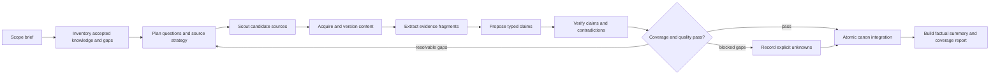

# Research and Verification System

**Status:** PROPOSED, PRIMARY DELIVERY TARGET

## Purpose

Research produces the authoritative input for every later feature. The system is not complete when an agent writes a plausible summary. It is complete when scoped technical claims are represented as typed artifacts, each material field is traceable to immutable source evidence, contradictions and unknowns are explicit, and an independent verification step accepts the result.

Tiering and theory implementation remain blocked until the acceptance gate in this document passes.

## Research principles

1. **Evidence before synthesis.** Models may propose claims, but only eligible evidence can support canon promotion.
2. **Claims, not pages, are the unit of verification.** One source can support one field and contradict another.
3. **Scope is mandatory.** Continuity, era, subject, operating conditions, and source canon level are recorded before research starts.
4. **Unknown is valid.** Missing evidence is stored as a gap, never filled with model knowledge.
5. **Contradictions are retained.** The system records incompatible evidence and resolution status rather than overwriting it.
6. **Research is incremental.** Repeat runs retrieve accepted knowledge and unresolved gaps first, then acquire only what can add coverage or resolve conflict.
7. **Raw content stays out of long-lived prompts.** Durable evidence fragments, structured summaries, and IDs replace transcript accumulation.

## Research target

Every run uses a versioned `ResearchBrief`:

```text
ResearchBrief
  world_id
  subject_ids
  continuity
  era_or_timepoint
  canon_policy_id
  objective
  requested_domains
  exclusions
  depth: SURVEY | STANDARD | DEEP
  source_budget
  model_budget
  completion_policy_id
```

A world name alone is insufficient. If continuity or era is unknown, the planner creates a discovery task and prevents conflicting continuities from being merged.

## Technical domain ontology

The initial domain catalog is versioned and extensible. A research plan selects relevant domains rather than forcing every subject to populate irrelevant fields.

| Domain | Required technical questions |
|---|---|
| Identity and scope | What subject, continuity, era, authority, territory, and included assets are being described? |
| Energy and resources | What sources, outputs, storage, scarcity, replenishment, and dependencies exist? |
| Industry and logistics | What can be produced, at what scale and rate, with what supply chain, repair, and replacement constraints? |
| Mobility and access | What transport modes, ranges, speeds, setup, navigation, throughput, and access restrictions apply? |
| Offense | What repeatable effects, ranges, rates, accuracy, targets, counters, and collateral limits are supported? |
| Defense and resilience | What protection, concealment, redundancy, recovery, attrition tolerance, and failure modes exist? |
| Information and control | What sensing, communication, computation, command, cyber, psychic, or predictive systems exist? |
| Biology and enhancement | What physical limits, reproduction, lifespan, adaptation, augmentation, and environmental needs apply? |
| Exotic mechanisms | What magical, dimensional, temporal, causal, conceptual, or ontological rules and limits are evidenced? |
| Scale and deployment | How many assets or users exist, where are they available, and are examples prototypes, elites, or standard issue? |
| Chronology and change | When is the capability valid, what supersedes it, and do retcons or losses alter availability? |
| Counters and limitations | What prevents, disrupts, exhausts, or defeats the capability, and how reliable is that counter? |

## Source and canon policy

Each world or continuity references a versioned `CanonPolicy` that ranks source classes. A practical default is:

1. Primary canonical work or official technical publication.
2. Official creator/publisher reference material.
3. Licensed reference material with no known contradiction.
4. Maintained secondary index or wiki used for discovery and cross-reference.
5. Community discussion, search snippets, and unsourced lists used only as leads.

Source rank does not replace claim-level analysis. A lower-ranked source cannot establish a disputed canon claim by itself, but it can locate a primary source. The policy records continuity rules, retcon handling, translations, adaptations, game mechanics, author statements, and whether absence-of-evidence claims are permitted.

## Durable research workflow



### 1. Scope and inventory

The workflow freezes the brief revision and retrieves:

- accepted artifact revisions in scope;
- current source revisions and evidence fragments;
- unresolved contradictions and rejected proposals;
- known research gaps and prior failed leads;
- source freshness and acquisition history.

This inventory prevents rediscovery and becomes the first context manifest. A repeat run must explain why each new query is expected to improve coverage, freshness, or contradiction resolution.

### 2. Plan

The Research Planner emits a `ResearchPlan` containing:

- domain questions and required indicators;
- current evidence coverage per question;
- prioritized leads;
- preferred source classes and domains;
- query groups;
- per-lead source, fetch, token, and time budgets;
- stop conditions;
- expected output artifact types.

Deterministic code rejects duplicate queries, questions already satisfied at required confidence, and plans outside the brief.

### 3. Scout

The Source Scout searches in bounded batches and returns normalized `SourceCandidate` records. Candidates include canonical URL, title, publisher/domain, source class, expected coverage, continuity hints, publication date, and discovery provenance.

Search snippets are never evidence. URL normalization and content hashes deduplicate mirrors and repeated discoveries. Domain diversity is preferred, but source independence is evaluated from publication lineage rather than hostname alone.

### 4. Acquire

The acquisition service, not the model, performs network access:

- validates scheme, host, redirects, address resolution, byte limit, and content type;
- fetches through the simplest suitable adapter before browser fallback;
- stores response metadata and raw body by content hash;
- extracts text and structure with versioned extractor metadata;
- creates a new immutable `SourceRevision` only when content changes;
- records failures with stable error codes and retry eligibility.

Fetch order is direct HTTP, structured/reader extraction, managed browser, then OCR for relevant assets. Browser use is a costly fallback, not the default tool path.

### 5. Extract evidence

The Evidence Extractor receives one bounded source revision plus explicit questions. It returns `EvidenceFragment` records:

```text
EvidenceFragment
  source_revision_id
  locator: page | section | paragraph | timestamp | image_region
  exact_excerpt
  normalized_statement
  domain
  subject_ids
  continuity
  temporal_scope
  support_role: SUPPORTS | CONTRADICTS | QUALIFIES | LEAD_ONLY
  extraction_confidence
```

Exact excerpts are immutable and bounded. Larger surrounding text remains in the blob store. The extractor cannot create canon artifacts.

### 6. Synthesize proposals

The Claim Synthesizer groups compatible fragments and emits typed `ArtifactProposal` objects. Initial artifact types are:

- `GenericConcept`
- `Mechanism`
- `Model`
- `Instance`
- `Capability`
- `Specification`
- `Constraint`
- `RelationshipAssertion`
- `DeploymentFact`
- `TimelineEvent`

`Mechanism` uses an extensible modality: technological, magical, psychic, biological, dimensional, reality-altering, temporal, causal, conceptual, ontological, or hybrid. The extractor and synthesizer record effects, targets, activation, costs, duration, control, reliability, dependencies, limits, counters, and causal or temporal behavior where evidenced. Exotic does not mean exempt from source or verification rules.

Generic, model, and instance scope are distinct. A generic fusion-engine mechanism can own shared operating principles; an engine model implements it and owns model specifications; a mech model uses or installs that engine model; a named mech instance can override configuration or condition without altering a parent revision. Effective views traverse these explicit links at query time and retain provenance instead of copying inherited facts.

Relationship assertions receive field-level evidence and audit decisions like nodes. Timeline events can introduce, disable, destroy, modify, reveal, or supersede nodes and relationships, and can link participants through exact, approximate, relative, disputed, looping, or branching fictional time.

Each field in a proposal identifies supporting and contradicting fragment IDs. Quantities store original value/unit, normalized value/unit when safe, bounds, approximation status, and derivation method. Derived values cite inputs and a deterministic calculation; the model cannot silently convert estimates into facts.

### 7. Verify

Verification has two layers.

**Deterministic validation** checks:

- schema and unit validity;
- scope and continuity consistency;
- all required evidence links exist;
- excerpts occur in the referenced source revision;
- no source is counted twice through a mirror or common lineage;
- canonical identity references resolve;
- duplicate and near-duplicate artifacts are handled;
- derived fields use an allowed calculation;
- confidence follows policy rather than model assertion.

**Evidence Auditor** checks:

- whether excerpts actually support each field;
- whether qualifiers and limitations were retained;
- whether stronger contradictory evidence exists in the supplied set;
- whether the proposal overgeneralizes a prototype, elite, peak, or one-off event;
- whether source rank is sufficient for the claim;
- whether more research can resolve the issue.

The auditor returns `ACCEPT`, `REVISE`, `NEEDS_EVIDENCE`, `CONTRADICTED`, or `REJECT` per proposal field with stable reason codes. Audit independence is configurable; the default routes synthesis and audit through different model calls and context manifests. A different provider can be required for high-impact or disputed claims when available, but lack of a second provider does not silently waive audit.

### 8. Resolve gaps and contradictions

The workflow loops only on actionable gaps. A `ResearchGap` records domain, question, missing indicator, attempted leads, next query, priority, and stop reason.

Contradictory evidence produces a `ClaimConflict` rather than forced consensus. Resolution can:

- split continuity, era, subject, or operating conditions;
- prefer a source under the canon policy while retaining dissent;
- narrow a claim;
- mark the claim disputed;
- leave the claim unresolved.

Repeated queries with no new eligible evidence trigger diminishing-return termination. Safety caps stop work as `PARTIAL` with explicit gaps, never as fully complete.

### 9. Integrate canon atomically

The Canon Integrator accepts only audited fields. One short transaction:

1. verifies input revisions and idempotency key;
2. creates or supersedes typed artifact revisions;
3. creates normalized artifact-evidence links;
4. records conflicts, decisions, and derivations;
5. updates coverage and freshness projections;
6. checkpoints the workflow and emits outbox events.

A retry with identical inputs returns the existing integration result. Accepted evidence is additive unless a new revision explicitly supersedes a prior conclusion.

### 10. Summarize

The Summary Builder reads accepted artifacts, conflicts, and gaps. It writes a factual structured summary with artifact revision citations. Summary text is a projection, not canon authority, and can be regenerated.

## Completion and quality model

Completion is evaluated per requested domain and for the run as a whole.

```text
domain_coverage = satisfied_required_indicators / applicable_required_indicators
verified_coverage = accepted_indicators / applicable_required_indicators
contradiction_rate = unresolved_material_conflicts / evaluated_material_claims
provenance_rate = cited_material_fields / material_fields
duplicate_rate = duplicate_promotions / promotion_attempts
```

Initial `STANDARD` completion policy:

- all applicable critical questions have an accepted answer or explicit gap;
- provenance rate is 1.0 for material fields;
- verified coverage is at least 0.80 overall and at least 0.60 in each requested domain;
- no unresolved contradiction invalidates a promoted material field;
- duplicate promotion rate is zero;
- every source and artifact revision is reproducible from stored metadata;
- required graph relationships and timeline effects meet the run's coverage policy;
- the independent audit has no unresolved `REVISE` or `NEEDS_EVIDENCE` decision;
- budget and stop reasons are recorded.

Thresholds are versioned by completion policy and tuned against fixtures. Lower coverage may produce `PARTIAL`; it cannot produce `COMPLETE`. A world-level explored flag is derived from accepted run coverage and policy, not directly set by an agent.

## Context and tool efficiency

The shared runtime rules in [04-agent-runtime.md](04-agent-runtime.md) apply with these research-specific constraints:

- Scout calls receive queries and compact prior-source metadata, not page bodies.
- Extraction calls receive one source or bounded coherent chunks and the questions they must answer.
- Synthesis calls receive selected evidence fragments grouped by domain and subject, not search history.
- Audit calls receive proposals, exact excerpts, source metadata, conflicts, and policy excerpts only.
- Integration is deterministic application code and does not require an LLM.
- Summaries are generated from accepted artifact projections, never raw acquisition transcripts.
- Each loop starts from durable gaps and manifests, so context size does not grow with run age.

At 40k, work is partitioned into more extraction and synthesis batches. Larger windows may compare more evidence and contradictions in one call, but do not add raw pages or the full transcript.

## Research data concepts

| Concept | Required fields |
|---|---|
| `canon_policy` | Scope, source ranking, continuity rules, adaptation/game/retcon policy, version. |
| `source` | Canonical identity, publisher/domain, source class, lineage, world/continuity scope. |
| `source_revision` | Source ID, content hash, retrieval metadata, extractor version, blob reference, timestamp. |
| `evidence_fragment` | Revision ID, locator, exact excerpt, normalized statement, scope, support role. |
| `research_plan` | Brief revision, questions, coverage baseline, leads, budgets, stop policy. |
| `research_gap` | Question, missing indicator, attempts, priority, status, stop reason. |
| `artifact_proposal` | Typed payload, field-evidence links, conflicts, producer call, status. |
| `audit_decision` | Proposal field, verdict, reason codes, evidence IDs, auditor call. |
| `claim_conflict` | Incompatible statements, scopes, evidence, materiality, resolution. |
| `promotion_decision` | Accepted fields, rejected fields, policy/procedure versions, integrator transaction. |
| `coverage_snapshot` | Requested domains, applicable indicators, accepted/unknown/conflicted counts, policy version. |

## Research acceptance gate

Tiering and theory work may begin only after all of the following pass:

1. A fresh installation seeds worlds from `backend/app/db/default_worlds.json` without importing legacy runtime data.
2. Representative simple, complex, contradictory, sparse, and multi-continuity fixtures complete with expected statuses.
3. Every promoted material field traces to an exact source revision and evidence fragment.
4. Unsupported model knowledge and search snippets fail promotion.
5. Contradictions, one-off feats, prototypes, and continuity conflicts are retained and correctly scoped.
6. Kill/restart tests at every research step resume without duplicate sources, evidence, proposals, or artifacts.
7. Repeat research reuses unchanged acquisitions, starts from known gaps, and produces no duplicate canon records.
8. The reference workflow completes with a 40k model budget and no full transcript replay.
9. Larger-window tests improve selected evidence or contradiction coverage without unbounded context growth.
10. Provider/key failures, browser failures, blocked sources, malformed output, and budget exhaustion produce inspectable partial or failed results.
11. Shared generic mechanisms, model specifications, instance overrides, evidence-linked edges, and branching timeline queries pass graph integrity and provenance tests.
12. Research, Knowledge, Validation, Provenance, Flow, Logs, and Settings surfaces operate against the new research projections.
13. The user reviews representative artifacts and provenance and accepts research quality.

Failure of any gate item keeps tiering and theory deferred.
