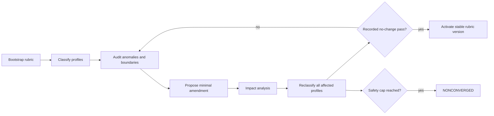

# Tiering and Theory Specification

**Status:** PROPOSED INITIAL RUBRIC AND PROCEDURE

**Delivery dependency:** DEFERRED until the research system in [05-research-system.md](05-research-system.md) passes its acceptance gate.

## Overview

Tier content changes through versioned, audited amendments. Tiering procedure remains strict, deterministic, and separately versioned. The system classifies a scoped `PowerProfile`, never an ambiguous whole setting.

## Classification subject: `PowerProfile`

A profile identifies one subject under explicit scope:

```text
PowerProfile
  subject_type: WORLD | FACTION | CIVILIZATION | ENTITY
  subject_id
  continuity
  era_or_timepoint
  operating_conditions
  mode: BASELINE | PEAK
  included_assets
  excluded_assets
  evidence_revision_ids
```

“Warhammer 40k,” “Marvel,” or another franchise name is not a valid profile. A valid profile might identify a named faction in a continuity and era, under sustainable wartime conditions, with listed allies excluded. A world profile covers that world's scoped aggregate participants and assets; it must state aggregation rules.

Create separate baseline and peak profiles. Baseline describes repeatable, maintained capability under normal doctrine. Peak describes the strongest sustainable configuration supported by evidence. A one-time outlier remains evidence for a spike label, not grounds to overwrite baseline.

## Capability dimensions

| Code | Dimension | Measures |
|---|---|---|
| `REACH` | Effective reach | Area where the subject can project consequential power on an operational timescale. |
| `OFFENSE` | Offensive effect | Repeatable destructive, disabling, or reality-altering effect against relevant targets. |
| `DEFENSE` | Defense/survivability | Resistance, recovery, redundancy, concealment, and continuity under peer attack. |
| `MOBILITY` | Mobility | Transit scale, speed, access constraints, deployment, and retreat. |
| `INDUSTRY` | Industry/logistics | Production, replacement, energy, supply, population, and campaign endurance. |
| `INFO` | Information/control | Sensing, coordination, computation, cyber/psychic control, deception, and command. |
| `EXOTIC` | Exotic/metaphysical | Causal, temporal, dimensional, conceptual, magical, or ontological effects. |
| `CONSTRAINTS` | Constraints | Scarcity, setup, reliability, self-harm, counters, jurisdiction, and dependence. |

`CONSTRAINTS` does not receive a 0-10 power score. It produces deterministic penalties and labels attached to affected dimensions.

## Terms

- **Sustainable:** the subject can repeat or maintain the capability for the rubric's operational duration without consuming an irreplaceable unique asset.
- **Controllable:** the subject can select a target and expected effect with evidence-backed reliability. Unaimed disasters do not count as controlled offense.
- **Outlier:** a feat outside the supported operating envelope, including one-off artifacts, external intervention, non-repeatable sacrifice, or contradicted narration.
- **Spike:** one dimension reaches at least two tiers above the assigned overall tier without satisfying core and logistics rules.
- **Gap:** one required dimension falls at least two tiers below the overall tier indicated by stronger dimensions.
- **Confidence:** evidence sufficiency and agreement, not estimated win probability.

## Initial Tier 0-10 content

These descriptions seed rubric version 1. Exact machine-readable thresholds belong in `rubric_tier` and may change through the amendment process.

| Tier | Initial description |
|---:|---|
| 0 | **Contemporary Earth anchor.** Present-day human civilization: global industrial base, chemical/nuclear arsenals, orbital support, no routine independent operations beyond near-Earth space. This anchor cannot move through ordinary amendment. |
| 1 | **Enhanced terrestrial.** Materially exceeds contemporary Earth in one or more repeatable terrestrial dimensions, but remains planet-bound and cannot sustain orbital dominance. Examples of scale include superior global sensing, robust superhuman units, or advanced weapons without an independent space economy. |
| 2 | **Planetary dominant.** Can defeat or control conventional planetary opposition and sustain global operations. Has decisive planetary offense/defense or control, but limited off-world logistics. Destroying a planet is not required. |
| 3 | **Orbital/cislunar.** Can establish, contest, supply, and replace assets across planetary orbit and nearby moons. Can impose durable orbital effects and survive meaningful anti-orbital opposition. |
| 4 | **System-capable.** Can conduct sustained campaigns across one star system with interplanetary logistics, relevant mobility, and effects against system-scale infrastructure or multiple planetary targets. |
| 5 | **Multi-system/interstellar.** Can project and replenish consequential forces across multiple star systems. Interstellar transit is operational, not a unique voyage. |
| 6 | **Regional interstellar.** Can coordinate sustained control or conflict across many systems and multiple fronts. Industry and information systems support regional interstellar replacement and governance. |
| 7 | **Sector-scale.** Can affect, contest, or administer a substantial stellar sector with repeatable force projection. Loss of individual systems does not collapse capability. |
| 8 | **Multi-sector/galactic contender.** Can sustain operations across major galactic regions or challenge several sector-scale peers. Strategic effects can alter galactic balances. |
| 9 | **Galactic dominant or reliably transgalactic.** Can impose durable outcomes across a galaxy, survive peer-level galactic conflict, or project equivalent controlled capability between galaxies with supporting logistics. |
| 10 | **Open-ended extreme.** Demonstrates sustainable, controlled capability beyond the Tier 9 envelope, including extreme galactic aggregates, multi-galactic, dimensional, causal, or metaphysical reach. A Warhammer 40k-like aggregate can calibrate the lower extreme range when scoped to a stated era and aggregation policy. It is neither a hard upper bound nor a franchise-specific definition. Record magnitude bands and vectors within Tier 10 rather than inventing an unreviewed Tier 11. |

Reach alone does not assign a tier. A portal to another galaxy without sustainable force, command, or supply is mobility evidence and likely a spike.

## Evidence and confidence

Each scored assertion cites exact immutable evidence revisions. Sources receive quality and independence metadata. The procedure calculates:

```text
support = weighted independent supporting evidence
contradiction = weighted contradictory evidence
coverage = required indicators with adequate evidence / required indicators
confidence = bucket(support, contradiction, coverage)
```

Initial buckets:

- `HIGH`: at least two independent strong sources for core indicators, coverage at least 0.8, no unresolved material contradiction.
- `MEDIUM`: one strong source or several weaker sources, coverage at least 0.6, contradictions bounded.
- `LOW`: coverage below 0.6, dependence on indirect statements, or unresolved contradiction.
- `INSUFFICIENT`: a required core dimension cannot be scored.

The rubric version stores exact weights and bucket thresholds. Narrative confidence cannot override them.

## Strict scoring and assignment

### Step 1: score each dimension

For each dimension, find the highest tier whose required indicators all pass with eligible evidence. Apply constraint penalties defined in the rubric. Do not average raw feats. Record `dimension_tier`, confidence, indicators, evidence IDs, penalties, and outliers.

### Step 2: core and support rules

Core dimensions are `REACH`, `OFFENSE`, `DEFENSE`, and `INDUSTRY`. `MOBILITY` is also core for Tier 3 and above. `INFO` must be within two tiers of the candidate at Tier 6 and above. `EXOTIC` is optional; it cannot compensate for failed core rules unless the rubric defines a measurable equivalent effect for that tier.

For candidate tier `T`:

1. at least three core dimensions must score `>= T`;
2. every core dimension must score `>= T - 1`;
3. `REACH >= T - 1` and `INDUSTRY >= T - 1` independently;
4. for `T >= 3`, `MOBILITY >= T - 1`;
5. for `T >= 6`, `INFO >= T - 2`;
6. no disqualifying constraint defined for `T` may remain unresolved;
7. core evidence confidence must meet the tier's minimum.

The overall tier is the highest `T` satisfying every rule. It is not the maximum dimension and not a rounded average.

### Step 3: labels

- Add `SPIKE:<dimension>@<tier>` when a dimension is at least two above overall.
- Add `GAP:<dimension>@<tier>` when a core dimension is at least two below the median of other core dimensions.
- Add `PEAK_ONLY`, `ONE_OFF`, `EXTERNAL_DEPENDENCY`, `SETUP_REQUIRED`, `LOW_CONTROL`, or `COUNTER_DEPENDENT` from constraint rules.
- Store outliers separately with inclusion status and reason code.

### Step 4: fail on insufficient core evidence

If any required core score is `INSUFFICIENT`, emit no overall tier. Return `INSUFFICIENT_EVIDENCE` with the dimension vector containing known values. Never map unknown to zero.

## Anomalies

Every anomaly has one direction:

| Direction | Meaning |
|---|---|
| `HIGHER_THAN_RUBRIC` | Evidence exceeds the highest expressible threshold or magnitude band. |
| `LOWER_THAN_RUBRIC` | Profile fails assumptions embedded in its apparent tier range. |
| `BOUNDARY_OVERLAP` | Adjacent tier predicates both match or neither separates the case. |
| `CROSS_DIMENSIONAL` | Extreme vector shape exposes a missing equivalence or core rule. |
| `INSUFFICIENT_EVIDENCE` | Required indicators lack eligible evidence. |
| `CONTRADICTORY_EVIDENCE` | Material evidence supports incompatible scores. |
| `ANCHOR_VIOLATION` | A proposed rubric change moves Tier 0 or violates another locked anchor. |

An anomaly is not permission for an agent to choose a convenient tier. It enters the audit and amendment workflow.

## Dynamic refinement and convergence

Tier **content** changes through immutable rubric versions. Tiering **procedure** executes the same ordered operations for every version. A procedure change requires its own version, reclassification impact report, and full reclassification.



Minimal amendment means the smallest predicate or threshold change that resolves a demonstrated defect while preserving locked anchors and unaffected boundaries. The proposal records changed fields, anomaly IDs, evidence revisions, expected classifications, and affected-profile query.

Impact analysis must include:

- profiles in changed tiers and adjacent tiers;
- profiles whose dimension values lie on changed thresholds;
- profiles sharing changed constraint or equivalence rules;
- all prior anomalies linked to changed content;
- anchor calibration profiles.

Reclassify every affected profile across all affected worlds and subjects. Do not limit a pass to the profiles that first exposed the anomaly.

Continue until one complete audit pass proposes no rubric change and produces no unresolved material anomaly. Record the no-change pass as a durable audit. An iteration cap is a safety stop. Reaching it returns `NONCONVERGED` with pending anomalies and the last stable active rubric; it never activates the candidate.

### Procedure pseudocode

```text
candidate = bootstrap_or_copy_active_rubric()
iteration = 0

while true:
    iteration += 1
    classifications = classify_all_profiles(candidate, PROCEDURE_VERSION)
    audit = audit_boundaries_anchors_and_anomalies(candidate, classifications)

    if audit.has_no_change and audit.material_anomalies.empty:
        record_no_change_pass(candidate, classifications, audit)
        activate(candidate)
        return STABLE

    if iteration >= safety_cap:
        record_nonconvergence(candidate, audit)
        return NONCONVERGED

    amendment = propose_minimal_amendment(candidate, audit)
    validate_locked_anchors(amendment)
    affected = impact_analysis(candidate, amendment, all_profiles)
    candidate = append_rubric_version(candidate, amendment)
    reclassify(affected, candidate, PROCEDURE_VERSION)
```

Classification itself is deterministic:

```text
for dimension in DIMENSION_ORDER:
    score[dimension] = highest_fully_satisfied_threshold(profile, evidence, rubric)
if required_core_unknown(score): return UNCLASSIFIED
for T from 10 down to 0:
    if core_rules_pass(T, score) and constraints_pass(T):
        return Classification(T, score, labels(score, T))
```

Agents may extract structured indicators and propose amendments. Code validates evidence eligibility, computes scores, checks core rules, finds impact sets, and decides convergence.

## Immutable history and schema concepts

| Concept | Required fields |
|---|---|
| `procedure_version` | ID, code/config hash, dimension order, core rules, confidence policy, status. |
| `rubric_version` | ID, parent ID, semantic version, status, amendment reason, locked anchors, content hash. |
| `rubric_tier` | Rubric ID, tier number, dimension predicates, required indicators, constraints, magnitude band. |
| `power_profile_revision` | Profile ID, revision, scope fields, included/excluded assets, evidence set hash. |
| `classification` | Profile revision, rubric version, procedure version, overall tier nullable, confidence, status, created run. |
| `classification_dimension` | Classification ID, dimension, tier nullable, indicator results, penalties, confidence. |
| `classification_evidence` | Classification/dimension, evidence revision, support/contradict role. |
| `anomaly` | Direction, profile revision, rubric/procedure versions, dimensions, evidence revisions, status. |
| `rubric_change_impact` | From/to rubric, profile revision, reason, prior/new result, reviewed status. |
| `rubric_audit` | Candidate version, pass number, findings, no-change flag, affected-set hash. |

Never update or delete an activated rubric, classification, profile revision, or audit. Corrections append records and supersession links. Every result ties to exact evidence revision IDs, not mutable URLs or artifact heads.

## Theory generation

A theory models a possible cross-world interaction. It never becomes canon by passing an audit.

```text
TheoryRevision
  subjects: profile_revision_ids
  premises: canon artifact/evidence revision references
  assumptions: explicit unsupported or simplifying propositions
  mechanism_compatibility: compatible | conditional | incompatible | unknown
  interaction_rules: translation rules between settings
  outcomes: scenario, probability band, sensitivity
  confidence: evidence and assumption assessment
  falsifiers: observations that would reject or materially change the theory
  status: DRAFT | AUDITED | REJECTED | SUPERSEDED
```

Generation steps:

1. select exact profile revisions and scenario conditions;
2. retrieve canon premises and contradictory evidence;
3. list assumptions separately from premises;
4. test mechanism compatibility, including cosmology, causality, magic/technology, time, and information rules;
5. produce conditional outcomes and sensitivity to assumptions;
6. name falsifiers and missing evidence;
7. audit citation validity, internal consistency, and canon/theory boundary;
8. append a theory revision.

An audited theory means the structure and reasoning are traceable under its assumptions. It does not mean the cross-world event is canon or true. UI and API responses label every theory as non-canon and show assumption count, compatibility, confidence, and falsifiers.

## Next steps

Use [07-implementation-plan.md](07-implementation-plan.md) to phase the schema, deterministic procedure, reference profiles, and convergence tests after research acceptance.
