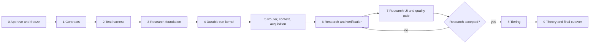

# Omniverse V2 Rebuild Implementation Plan

**Status:** BLOCKED ON USER APPROVAL
**Scheduling model:** phase gates, no date or staffing estimates

## Overview

This plan rebuilds the application behind testable contracts and starts with a fresh database. The only initial data is the world registry imported from `backend/app/db/default_worlds.json`. Existing databases, providers, keys, runs, notebook data, artifacts, rubrics, classifications, and theories are not migrated.

Research is the critical path. Tiering and theory are deferred until research quality, verification, provenance, durability, context efficiency, and the retained research-facing UI pass a dedicated acceptance gate.

## Delivery rules

1. Write an acceptance or contract test before production behavior.
2. Observe the test fail for the intended reason.
3. Implement the smallest behavior that passes.
4. Run focused tests, then the clean non-network suite.
5. Review security, context, provenance, and observability effects.
6. Meet the phase gate before dependent work starts.
7. Never classify an incomplete phase as successful because a retry or iteration limit was reached.

The old application may remain available as a source reference, but its database contents are disposable and impose no compatibility requirement.

## Phase sequence

## Phase 0: approval and baseline freeze

**Dependencies:** explicit approval of this documentation set.

**Deliverables**

- Record approved architecture decisions and open decisions.
- Confirm `backend/app/db/default_worlds.json` as the only seed source.
- Inventory active routes, retained templates, source modules, and current test files for reference.
- Capture retained page screenshots and fragment shapes as presentation references.
- Mark current behaviors as retain, replace, or remove; do not preserve known defects.

**Acceptance gate**

- The user approves the documentation and clean-start policy.
- Every frontend surface has a disposition.
- No requirement depends on reading a legacy runtime database.

## Phase 1: domain and contract baseline

**Dependencies:** Phase 0.

**Deliverables**

- Domain glossary and package dependency rules.
- Pydantic contracts for worlds, runs, research briefs/plans/gaps, sources, evidence, proposals, audits, artifacts, tools, providers, errors, pagination, and HTMX projections.
- `/api/v2` research-first route catalog and command idempotency rules.
- Research workflow transition table, completion predicates, and partial/failure semantics.
- Credential-reference interface and local storage policy. Credentials can be configured after the rewrite; none are seeded.
- Versioned canon policy, research ontology, and completion policy contracts.
- Contracts for generic concepts, mechanisms, models, instances, specifications, timeline branches/events, and evidence-linked relationship assertions.

**Test-first work**

- Contract serialization and strict validation tests.
- Error envelope, cursor, idempotency, and write-only credential tests.
- Static dependency tests preventing domain code from importing FastAPI, templates, providers, or ORM mappings.

**Acceptance gate**

- Research contracts cover normal, partial, contradictory, insufficient-evidence, cancelled, budget-exhausted, and overflow outcomes.
- A material claim cannot be represented without scope and evidence-link fields.
- The user approves API and research completion boundaries.

## Phase 2: clean test harness

**Dependencies:** Phase 1 contracts.

**Deliverables**

- One documented test command and configuration source.
- Temporary SQLite, blob, and credential directories per test worker.
- No import-time network, browser launch, or writes to repository data.
- Deterministic fake Gemini, OpenAI, OpenAI-compatible, browser, search, fetch, OCR, clock, and failure adapters.
- Explicit `unit`, `integration`, `ui`, `network`, `slow`, and `evaluation` selections without duplicate execution.
- Seed fixtures derived from a small subset of `default_worlds.json`.

**Test-first work**

- Harness self-tests for database isolation, restart simulation, marker selection, network denial, redaction, and cleanup.

**Acceptance gate**

- Two clean-suite runs select and execute the same tests.
- Non-network tests cannot access the public network or checked-in data files.
- Provider and acquisition failures can be injected deterministically.

## Phase 3: research domain and persistence foundation

**Dependencies:** clean harness and approved research contracts.

**Deliverables**

- SQLAlchemy 2.x mappings and repositories for registry, sources, evidence, canon, research workspace, runs, context, providers, and operations.
- Alembic baseline with forward and rollback tests where rollback is safe.
- Fresh-install bootstrap and idempotent world registry importer from `default_worlds.json`.
- Versioned built-in canon and research-completion policy definitions activated on first startup; these are application policy defaults, not imported user data.
- WAL, foreign keys, busy timeout, transaction policy, and SQLite online backup.
- Typed artifact revisions, field-level evidence links, conflicts, gaps, audit decisions, and promotion decisions.
- Typed canon graph nodes and revisioned relationship assertions for generic concepts, mechanisms, models, instances, specifications, capabilities, constraints, deployment facts, and timelines.
- Content-addressed blob store with integrity and reference tracking.

**Test-first work**

- Domain invariant tests before mappings.
- Repository contracts, foreign-key constraints, optimistic concurrency, and transaction rollback tests.
- Seed idempotency and duplicate-world tests.
- Property tests for immutable revisions and content-hash deduplication.

**Acceptance gate**

- A fresh database reaches schema head and imports the default registry exactly once.
- No legacy database is opened during startup or tests.
- Invalid scope, dangling evidence, invalid graph cycles, duplicate active revisions, and destructive history updates fail.
- Deleting unreferenced cache does not invalidate accepted evidence metadata.

## Phase 4: durable run kernel

**Dependencies:** Phase 3 run schema and unit of work.

**Deliverables**

- Application-owned state machine, scheduler, leases, attempts, checkpoints, cancellation, retry, resume, and outbox.
- Research workflow skeleton with typed step inputs and outputs.
- Startup reconciliation and terminal-state rules.
- Read projections for runs, targets, steps, attempts, and events.
- Idempotent effect execution and deterministic completion predicates.

**Test-first work**

- Transition tests reject illegal state changes.
- Kill/restart tests at pre-effect, post-effect/pre-checkpoint, and post-checkpoint boundaries.
- Duplicate command, lease, tool result, promotion, and completion callback tests.
- Multi-target tests prove one success cannot hide another failure.

**Acceptance gate**

- The workflow survives forced process termination at every step boundary without duplicate effects.
- Cancellation survives restart.
- No target is complete without all required accepted outputs.
- LangGraph, if retained inside a reasoning step, cannot mutate authoritative run state.

## Phase 5: provider router, bounded context, and acquisition

**Dependencies:** durable kernel, provider schema, blob store.

**Deliverables**

- Gemini, OpenAI, and generic OpenAI-compatible adapters.
- Provider/model discovery, capabilities, write-only credentials, routes, key rotation, durable cooldowns, and normalized errors.
- Context manifests, provider-aware token budgets, retrieval, raw-result spill, structured summaries, final payload counting, emergency compaction, and fail-closed overflow.
- Search, direct fetch, browser fallback, extraction, OCR, URL safety, content hashing, and source revisioning.
- Token, cost, latency, candidate, fetch, byte, cache, and context observability.

**Test-first work**

- Adapter contracts against fake servers.
- Routing matrices for auth, quota, rate limit, capability, timeout, malformed response, and internal errors.
- 40k reference scenarios and larger-window scaling tests.
- Tests prove calls rebuild from manifests and exclude full transcripts and raw source bodies.
- Acquisition fixtures cover redirects, private targets, size limits, browser failure, changed content, and duplicate mirrors.
- Secret redaction tests cover API, HTML, logs, exceptions, backups, and exports.

**Acceptance gate**

- The same typed call works across all required provider families when capabilities permit.
- Multiple keys fail over without leaking or disabling unrelated credentials.
- A second overflow after emergency compaction terminates before another provider call.
- Restart preserves health, cooldown, summaries, source revisions, and context manifests.
- The 40k baseline and larger-window scaling acceptance criteria pass.

## Phase 6: research and verification pipeline

**Dependencies:** Phases 3-5.

**Deliverables**

- Scope/inventory, planner, scout, extractor, synthesizer, evidence auditor, deterministic integrator, and factual summary steps.
- Versioned canon policies and technical domain coverage.
- Evidence fragments with exact locators and support roles.
- Typed proposals with field-level support and contradiction links.
- Generic-to-model-to-instance resolution, explicit applicability links, reusable specifications, relationship coverage, and temporal/continuity branches.
- Research schemas for technological and exotic mechanisms, including magic and reality-altering, temporal, causal, conceptual, and ontological effects, without tier labels.
- Deterministic validation for units, scope, identity, duplicate lineage, excerpts, derivations, and confidence.
- Contradiction resolution, explicit unknowns, research gaps, diminishing-return stop rules, and partial outcomes.
- Atomic canon promotion and incremental repeat-research behavior.

**Test-first work**

- Golden fixtures for direct canon, weak secondary leads, blocked sources, changed pages, OCR, duplicate mirrors, conflicting continuities, prototypes, one-off feats, quantities, and contradictions.
- Negative tests prove search snippets, model memory, absent citations, fabricated excerpts, and wrong-continuity evidence cannot promote.
- Graph tests prove many models can reference one generic mechanism without duplication, instance overrides preserve parent revisions, edge assertions require evidence, and temporal queries select the correct continuity and era facts.
- Exotic-mechanism fixtures verify activation, cost, control, duration, limits, counters, and causal or temporal semantics without premature ranking.
- Audit tests cover `ACCEPT`, `REVISE`, `NEEDS_EVIDENCE`, `CONTRADICTED`, and `REJECT` per field.
- Repeat-run tests reuse accepted evidence, target gaps, and prevent duplicate artifacts.
- Failure tests prove incomplete integration cannot mark a target complete or explored.

**Acceptance gate**

- Representative runs produce typed, field-cited, reproducible artifacts.
- Every material field has accepted evidence or is explicitly unknown.
- Contradictions and qualifiers remain visible through integration.
- Completion metrics and stop reasons match the versioned policy.
- Research runs remain bounded and restart-safe.

## Phase 7: research UI adaptation and quality hardening

**Dependencies:** stable research projections and Phase 6 acceptance.

**Deliverables**

- Adapt Research, world list/details, Knowledge, Logs, Settings, Validation, Provenance, and Flow to new projections.
- Correct HTMX payloads, targets, response types, pagination, filters, polling, and terminal events.
- Real evidence review, contradiction, gap, source, and provenance interfaces.
- Research coverage and quality reports by target and domain.
- Soak and evaluation suite across simple, complex, sparse, contradictory, and multi-continuity worlds.
- Prompt/tool tuning based on measured retrieval quality, redundant calls, token use, cache reuse, and audit rejection reasons.

**Frontend disposition**

| Surface | Presentation | Research-stage action |
|---|---|---|
| Shell/home | RETAIN | Update navigation and status projections. |
| Research | RETAIN/ADAPT | Replace run selection, filters, start response, progress, and result contracts. |
| World fragments/details | RETAIN/ADAPT | Use world, coverage, artifact, and gap projections. |
| Knowledge | RETAIN/ADAPT | Show accepted artifacts, conflicts, gaps, sources, and summaries. |
| Logs | RETAIN/ADAPT | Use durable event cursors and explicit terminal events. |
| Settings | RETAIN/ADAPT | Use write-only keys, provider routes, capability, and health projections. |
| Validation | REPLACE BEHAVIOR | Review field-level audit and promotion decisions. |
| Provenance | REPLACE DATA | Render source revision to evidence to artifact revision. |
| Flow | REPLACE DATA | Render durable research steps, attempts, and tool events. |
| Theory | DEFER | Keep presentation unavailable or clearly marked until Phase 9. |
| Deprecated Worlds | REMOVE | Consolidate into Research and Knowledge. |
| Choose-world | REMOVE | Consolidate into Research selection. |

**Test-first work**

- Fragment contracts before template changes.
- Browser tests for selection, duplicate submission, restart/polling, cancellation, evidence inspection, conflict review, gap follow-up, provider setup, and secret masking.
- Evaluation fixtures compare expected claims and prohibited claims, not prose wording.
- Performance tests measure source reuse, context size, tool-call count, and SQLite contention.

### Research quality gate

Tiering and theory remain blocked until:

- all 13 acceptance items in [05-research-system.md](05-research-system.md) pass;
- required research-facing UI journeys pass without conditional skips;
- no critical or high-severity research, provenance, durability, context, or credential defect remains;
- repeated fixture runs are deterministic except for explicitly measured model variance;
- model variance does not bypass deterministic validation or evidence requirements;
- the user reviews representative outputs and approves research quality.

If this gate fails, work returns to Phases 5-7. It does not proceed to tiering.

## Phase 8: dynamic tiering

**Dependencies:** approved research quality gate and sufficient accepted evidence profiles.

**Deliverables**

- `PowerProfile` revision workflow and initial machine-readable Tier 0-10 rubric.
- Tiering schema revisions added only now, after the research gate.
- Deterministic dimension scoring, core/logistics/reach rules, labels, confidence, and anomaly directions.
- Bootstrap, classify, audit, minimal amendment, impact analysis, affected-profile reclassification, no-change, and nonconvergence workflows.
- Tiering projections and UI integrated after the research surfaces are stable.

**Test-first work**

- Boundary fixtures for every tier and dimension using accepted research records.
- Metamorphic tests: unsupported outliers cannot raise baseline; removing logistics cannot raise a result.
- Higher/lower, overlap, cross-dimensional, contradiction, anchor, impact-set, history, oscillation, and iteration-cap tests.
- Reproducibility tests lock profile, evidence, procedure, and rubric revisions.

**Acceptance gate**

- The initial reference profile set reaches a recorded no-change pass or ends explicitly `NONCONVERGED`.
- Every supported anomaly causes a minimal audited amendment and complete affected-set reclassification.
- Retry or iteration exhaustion never activates an unstable rubric.
- The user accepts the initial hierarchy and anomaly behavior.

## Phase 9: theory, remaining UI, and clean cutover

**Dependencies:** stable research; Phase 8 for tier-aware theories where required.

**Deliverables**

- Structured theory generation and audit with premises, assumptions, mechanism compatibility, outcomes, confidence, and falsifiers.
- Theory schema revisions added only now, after the research gate.
- Theory presentation wired to real revision and audit commands.
- Canon/theory contamination tests and explicit theory-to-research handoff for evidence requests.
- Fresh-install setup, schema upgrade, seed, backup, restore, and reset documentation.
- Remove `/api/v1`, dead routes, obsolete templates, and legacy tests after replacements exist.
- Final release and rollback package.

### Clean cutover

1. Stop the old application.
2. Back up old files only as an emergency archive; do not read them into the new application.
3. Create a new data directory.
4. Apply Alembic schema revisions.
5. Import `backend/app/db/default_worlds.json` idempotently.
6. Start the new application on loopback.
7. Add providers and keys through the new Settings UI.
8. Run health, seed-count, research, backup, and restore smoke tests.
9. Delete or archive old databases only after user approval.

Rollback stops the new application and starts the old code against its untouched old data directory. No reverse data conversion is required because legacy data has no migration requirement.

**Acceptance gate**

- Fresh install, schema upgrade, default-world seed, provider setup, backup, restore, and reset pass.
- Critical research, tiering, and theory journeys pass according to enabled scope.
- No release test relies on a legacy database or external network by default.
- The user explicitly authorizes final cutover.

## Legacy test disposition

Do not bulk-port the roughly 1,015 legacy test functions. Classify each file:

| Disposition | Use |
|---|---|
| RETAIN AS PRESENTATION REFERENCE | Visual or fragment behavior intentionally preserved. |
| REWRITE AS CONTRACT | Useful requirement expressed against old internals or routes. |
| REPLACE | Behavior moves to durable workflow, typed domain, or `/api/v2`. |
| DELETE AS STALE | Unmounted code, duplicate APIs, nominal workflow paths, or superseded schema. |
| QUARANTINE LIVE | Real provider/browser evaluations excluded from deterministic release tests. |

Track each file with rationale and replacement test IDs. Test count is not a success metric; requirement and risk coverage are.

## Risks and controls

| Risk | Control | Gate |
|---|---|---|
| Research returns plausible but unsupported claims | Field-level evidence, exact excerpts, deterministic validation, independent audit | 6, 7 |
| Context compaction omits critical evidence | Pinned evidence, manifests, citation validation, 40k fixtures | 5-7 |
| Repeat runs waste calls or duplicate canon | Gap-first plans, hashes, idempotency, accepted-knowledge inventory | 6, 7 |
| Provider behavior differs from advertised capability | Conservative probes, fake adapter contracts, manual overrides | 5 |
| Browser/acquisition complexity dominates research | Direct-fetch-first adapters, bounded fallback, source cache | 5-7 |
| SQLite writer contention | One scheduler, short transactions, WAL, bounded concurrency | 3-7 |
| Duplicate effects after restart | Atomic checkpoints and deterministic effect keys | 4-7 |
| Secret leakage | Write-only DTOs, credential references, centralized redaction tests | 1, 5, 7, 9 |
| Frontend retention preserves broken semantics | Projection contracts and explicit replace decisions | 7 |
| Tier rubric oscillates | Research gate, minimal amendments, affected sets, nonconvergence | 8 |
| Theory contaminates canon | Separate aggregates, repositories, projections, and negative tests | 3, 9 |
| Legacy tests create false confidence | New clean harness and file-level disposition | all |

## Requirements traceability

| Requirement group | Primary phases | Acceptance evidence |
|---|---|---|
| FR-001-009 worlds/research/evidence | 1, 3, 6, 7 | AC-11, AC-12, research quality gate |
| FR-010-015 runs/agents | 1, 4-7 | AC-01, restart and handoff tests |
| FR-020-025 providers/routing | 3, 5, 7 | AC-04, AC-05 |
| FR-030-037 context | 5-7 | AC-02, AC-03, overflow tests |
| FR-040-046 tiering/theory | 8, 9 | AC-06-08 and research prerequisite |
| FR-050-054 API/HTML | 1, 7-9 | AC-10 and contract suite |
| FR-060-069 verified knowledge graph | 1, 3, 6, 7 | Graph integrity, temporal query, provenance, and exotic-mechanism tests |
| NFR-001-010 | 2-9 | Phase gates, security, durability, backup suites |
| Clean-start directive | 0, 3, 9 | AC-09 and seed tests |

## Stop conditions

Return to documentation review if implementation would require:

- migrating legacy database contents;
- multiple authoritative databases;
- LangGraph ownership of durable run state;
- theory records in canon queries;
- exposed stored secrets;
- provider calls after unresolved context overflow;
- tiering before research acceptance;
- treating research, audit, or tier iteration caps as success;
- multi-user or distributed coordination.

## Authorization

No implementation, test rewrite, schema, seed, or application change starts before explicit user approval of this documentation set.
